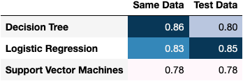
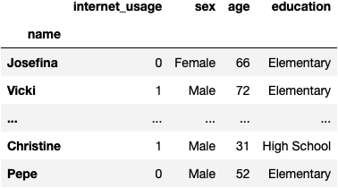
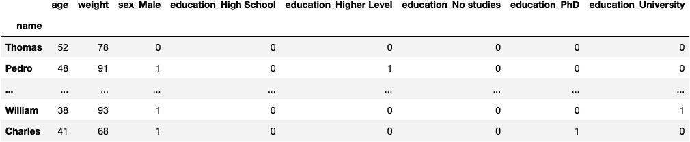

```python
import dataframe_image as dfi
import matplotlib.pyplot as plt
```


**© Jesús López**

Ask him any doubt on **[Twitter](https://twitter.com/jsulopz)** or **[LinkedIn](https://linkedin.com/in/jsulopz)**

# #03 | Train Test Split for Model Selection

<a href="https://colab.research.google.com/github/jsulopz/machine-learning/blob/main/03_Model%20Selection.%20Decision%20Tree%20vs%20Support%20Vector%20Machines%20vs%20Logistic%20Regression/03_model-selection_session_solution.ipynb">
  
</a>

## Chapter Importance

Machine Learning models learn a mathematical equation from historical data.

Not all Machine Learning models predict the same way; some models are better than others.

We measure how good a model is by calculating its score (accuracy).

So far, we have calculated the model's score with the same data that was used to fit (train) the mathematical equation. That's cheating. That's overfitting.

This tutorial compares 3 different models:

- Decision Tree
- Logistic Regression
- Support Vector Machines

We validate the models in 2 different ways:

1. Using the same data during training
2. Using 30% of the data; not used during training

To demonstrate how the selection of the best model changes if we are to validate the model with data not used during training.

For example, the image below shows the best model, when using the same data for validation, is the Decision Tree (0.86 accuracy). Nevertheless, everything changes when the model is evaluated with data not used during training; the best model is the Logistic Regression (0.85 accuracy). Whereas the Decision Tree only gets up to 0.80 of accuracy.



Were we a bank whose losses rank up to 1M USD due to 0.01 fail in accuracy, we would have lost 5M USD. This is something that happens in real life.

In short, banks are interested in good models to predict new potential customers. Not historical customers who have already gotten a loan and the bank knows if they were good to pay or not.

This tutorial shows you step-by-step how to implement the `train_test_split` technique to reduce overfitting with a practical use case where we want to classify wether a person used Internet or not.

## Load the Data

Load the dataset from [CIS](https://www.cis.es/cis/opencms/ES/index.html) executing the lines of code below:
- The goal of this dataset is
- To predict `internet_usage` of **people** (rows)
- Based on their **socio-demographical characteristics** (columns)


```python
import pandas as pd #!

df_internet = pd.read_excel('https://github.com/jsulopzs/data/blob/main/internet_usage_spain.xlsx?raw=true', sheet_name=1, index_col=0)
df_internet
```



## Preprocess the Data

We should already know from the previous chapter that the data might be preprocessed before passing it to the function that computes the mathematical equation.

### Missing Data

The function `.fit()` all the cells in the DataFrame to contain a value. Not `NaN`, which means "Not a Number" (i.e., cell for which we don't have any information). Otherwise, it won't know how to process the row and compare it to others.

For example, if you miss John's age, you cannot place the John in the space to compare with other people because the point might be anywhere.


```python
df_internet.isna().sum()
```


    internet_usage    0
    sex               0
    age               0
    education         0
    dtype: int64


### Dummy Variables

The function `.fit()` needs the values to be numeric. Otherwise, Python won't know the position of the axes in which to allocate the point. For example, if you have *Male* and *Female*, at which distance do you separate them, and why? You cannot make an objective assesment unless you separate each category.

Therefore, categories of the categorical columns will be transformed to be new columns (one new column per category) and contain 1s and 0s depending on wether the person is or is not the category.


```python
df_internet = pd.get_dummies(df_internet, drop_first=True)
df_internet
```


## Feature Selection

Once we have preprocessed the data, we select the column we want to predict (target) and the columns we will use to explain the prediction (features/explanatory).


```python
target = df_internet.internet_usage
features = df_internet.drop(columns='internet_usage')
```

## Build & Compare Models' Scores

We should already know that Machine Learning procedure is the same all the time:
    
1. Computing a mathematical equation: **fit**
2. To calculate predictions: **predict**
3. And compare them to the reality: **score**

The only element that changes is the `Class()` that contains lines of code of a specific algorithm (DecisionTreeClassifier, SVC, LogisticRegression).

### `DecisionTreeClassifier()` Model in Python


```python
from sklearn.tree import DecisionTreeClassifier

model_dt = DecisionTreeClassifier()
model_dt.fit(X=features, y=target)

model_dt.score(X=features, y=target)
```


    0.859877800407332


### `SVC()` Model in Python


```python
from sklearn.svm import SVC

model_svc = SVC(probability=True)
model_svc.fit(X=features, y=target)

model_svc.score(X=features, y=target)
```


    0.7837067209775967


### `LogisticRegression()` Model in Python


```python
from sklearn.linear_model import LogisticRegression

model_lr = LogisticRegression(max_iter=1000)
model_lr.fit(X=features, y=target)

model_lr.score(X=features, y=target)
```


    0.8334012219959267


## Function to Automate Lines of Code

- We repeated all the time the same code:

```python
model.fit()
model.score()
```

- Why not turning the lines into a `function()` to **automate the process**?

```python
calculate_accuracy(model=dt)
calculate_accuracy(model=svm)
calculate_accuracy(model = lr)
```

- To calculate the `accuracy`

### Make a Procedure Sample for `DecisionTreeClassifier()`


```python
model_dt = DecisionTreeClassifier()
model_dt.fit(X=features, y=target)
model_dt.score(X=features, y=target)
```


    0.859877800407332


### Automate the Procedure into a `function()`

**Code Thinking**

1. Think of the functions `result`
2. Store that `object` to a variable
3. `return` the `result` at the end
4. **Indent the body** of the function to the right
5. `def`ine the `function():`
6. Think of what's gonna change when you execute the function with `different models`
7. Locate the **`variable` that you will change**
8. Turn it into the `parameter` of the `function()`


```python
model_dt = DecisionTreeClassifier()
model_dt.fit(X=features, y=target)
model_dt.score(X=features, y=target)
```


    0.859877800407332


#### Distinguish the line that gives you the `result` you want and put it into a variable


```python
model_dt = DecisionTreeClassifier()
model_dt.fit(X=features, y=target)
result = model_dt.score(X=features, y=target) #new
```

#### Add a line with a `return` to tell the function the object you want in the end
model_dt = DecisionTreeClassifier()
model_dt.fit(X=features, y=target)
result = model_dt.score(X=features, y=target)

return result #new
#### Indent everything to the right
    model_dt = DecisionTreeClassifier()
    model_dt.fit(X=features, y=target)
    result = model_dt.score(X=features, y=target)

    return result
#### Define the function in the first line
def calculate_accuracy(): #new

    model_dt = DecisionTreeClassifier()
    model_dt.fit(X=features, y=target)
    result = model_dt.score(X=features, y=target)

    return result
#### What am I gonna change every time I run the function


```python
def calculate_accuracy(model_dt): #modified

    model_dt.fit(X=features, y=target)
    result = model_dt.score(X=features, y=target)

    return result
```

#### Generalize the name of the parameter


```python
def calculate_accuracy(model): #modified

    model.fit(X=features, y=target) #modified
    result = model.score(X=features, y=target)

    return result
```

#### Add docstring


```python
def calculate_accuracy(model):
    """
    This function calculates the accuracy for a given model as a parameter #modified
    """
    
    model.fit(X=features, y=target)
    result = model.score(X=features, y=target)

    return result
```


```python
calculate_accuracy(model_dt)
```


    0.859877800407332


## Calculate Models' Accuracies

### `DecisionTreeClassifier()` Accuracy


```python
calculate_accuracy(model_dt)
```


    0.859877800407332


We shall create an empty dictionary that keeps track of every model's score to later choose the best one.


```python
dic_accuracy = {}
dic_accuracy['Decision Tree'] = calculate_accuracy(model_dt)
```

### `SVC()` Accuracy


```python
dic_accuracy['Support Vector Machines'] = calculate_accuracy(model_svc)
dic_accuracy
```


    {'Decision Tree': 0.859877800407332,
     'Support Vector Machines': 0.7837067209775967}


### `LogisticRegression()` Accuracy


```python
dic_accuracy['Logistic Regression'] = calculate_accuracy(model_lr)
dic_accuracy
```


    {'Decision Tree': 0.859877800407332,
     'Support Vector Machines': 0.7837067209775967,
     'Logistic Regression': 0.8334012219959267}


## Which is the Best Model?

The Decision Tree is the best model with an score of 85%:


```python
sr_accuracy = pd.Series(dic_accuracy).sort_values(ascending=False)
sr_accuracy
```


    Decision Tree              0.859878
    Logistic Regression        0.833401
    Support Vector Machines    0.783707
    dtype: float64


Let's suppose for a moment we are a bank to understand the importance of this chapter. A bank's business is, among other things, to give loans to people who can afford it.

Although the bank may commit mistakes: to give loans to people who cannot afford it or not to give to people who can.

Let's image the bank losses £1M for each 1% of missclassification. As we chose the Decision Tree the bank losses $15M as the score suggests. Nevertheless, can we trust the score of 85%?

No, because we are cheating the model's evaluation; we evaluated the models with the same data used for training. In other words, the bank is not interested in evaluating the model the historical customers, they want to know how good is the model for customers to come.

They cannot create artificial customers, what can they do then?

They separate the data into a train set (70% of customers) used to `.fit()` the mathematical equation and a test set (30% of customers) to evaluate the mathematical equation.

You can understand the problem better with the follwing analogy:

## University Access Exams Analogy

Let's **imagine**:

1. You have a `math exam` on Saturday
2. Today is Monday
3. You want to **calibrate your level in case you need to study more** for the math exam
4. How do you calibrate your `math level`?
5. Well, you've got **100 questions `X` with 100 solutions `y`** from past years exams
6. You may study the 100 questions with 100 solutions `fit(100questions, 100solutions)`
7. Then, you may do a `mock exam` with the 100 questions `predict(100questions)`
8. And compare `your_100solutions` with the `real_100solutions`
9. You've got **90/100 correct answers** `accuracy` in the mock exam
10. You think you are **prepared for the maths exam**
11. And when you do **the real exam on Saturday, the mark is 40/100**
12. Why? How could have we prevented this?
13. **Solution**: separate the 100 questions into `70 for train` to study & `30 for test` for the mock exam.
    1. fit(70questions, 70answers)
    2. your_30solutions = predict(30questions)
    3. your_30solutions ?= 30solutions

## `train_test_split()` the Data

- The documentation of the function contains a typical example.


```python
from sklearn.model_selection import train_test_split

X_train, X_test, y_train, y_test = train_test_split(
    features, target, test_size=0.30, random_state=42)
```

### What the heck is returning the function?

From all the data:
- 2455 rows
- 8 columns


```python
df_internet
```


- 1728 rows (70% of all data) → to fit the model
- 7 columns (X: features variables)


```python
X_train
```


- 737 rows (30% of all data) → to evaluate the model
- 7 columns (X: features variables)


```python
X_test
```



- 1728 rows (70% of all data) → to fit the model
- 1 columns (y: target variable)


```python
y_train
```


    name
    Eileen     0
    Lucinda    1
              ..
    Corey      0
    Robert     1
    Name: internet_usage, Length: 1718, dtype: int64


- 737 rows (30% of all data) → to evaluate the model
- 1 columns (y: target variable)


```python
y_test
```


    name
    Thomas     0
    Pedro      1
              ..
    William    1
    Charles    1
    Name: internet_usage, Length: 737, dtype: int64


### `fit()` the model with Train Data


```python
model_dt.fit(X_train, y_train)
```


    DecisionTreeClassifier()


### Compare the predictions with the real data


```python
model_dt.score(X_test, y_test)
```


    0.8046132971506106


## Optimize All Models & Compare Again

### Make a Procedure Sample for `DecisionTreeClassifier()`


```python
model_dt = DecisionTreeClassifier()
model_dt.fit(X_train, y_train)
model_dt.score(X_test, y_test)
```


    0.8032564450474898


### Automate the Procedure into a `function()`

**Code Thinking**

1. Think of the functions `result`
2. Store that `object` to a variable
3. `return` the `result` at the end
4. **Indent the body** of the function to the right
5. `def`ine the `function():`
6. Think of what's gonna change when you execute the function with `different models`
7. Locate the **`variable` that you will change**
8. Turn it into the `parameter` of the `function()`


```python
def calculate_accuracy_test(model):

    model.fit(X_train, y_train)
    result = model.score(X_test, y_test)

    return result
```

## Calculate Models' dic_accuracy

### `DecisionTreeClassifier()` Accuracy


```python
dic_accuracy_test = {}

dic_accuracy_test['Decision Tree'] = calculate_accuracy_test(model_dt)
dic_accuracy_test
```


    {'Decision Tree': 0.8032564450474898}


### `SVC()` Accuracy


```python
dic_accuracy_test['Support Vector Machines'] = calculate_accuracy_test(model_svc)
dic_accuracy_test
```


    {'Decision Tree': 0.8032564450474898,
     'Support Vector Machines': 0.7788331071913162}


### `LogisticRegression()` Accuracy


```python
dic_accuracy_test['Logistic Regression'] = calculate_accuracy_test(model_lr)
dic_accuracy_test
```


    {'Decision Tree': 0.8032564450474898,
     'Support Vector Machines': 0.7788331071913162,
     'Logistic Regression': 0.8548168249660787}


## Which is the Best Model with `train_test_split()`?

The picture change quite a lot as the bank is lossing £20M due to the model we chose before: the Decision Tree; the score in data that hasn't seen during training (i.e., new customers) is 80%.

We should have chosen the Logistic Regression because it's the best model (85%) to predict new data, new customers.

In short, we loss £15M if we choose the Logistic Regression, which it's better than the Decision Tree's loss at £20M. Those £5M can make a differnece in my life 👀


```python
sr_accuracy_test = pd.Series(dic_accuracy_test).sort_values(ascending=False)
sr_accuracy_test
```


    Logistic Regression        0.854817
    Decision Tree              0.803256
    Support Vector Machines    0.778833
    dtype: float64


```python
df_accuracy = pd.DataFrame({
    'Same Data': sr_accuracy,
    'Test Data': sr_accuracy_test
})

df_accuracy.style.format('{:.2f}').background_gradient()
```


<a rel="license" href="http://creativecommons.org/licenses/by-nc-nd/4.0/"></a><br />This work is licensed under a <a rel="license" href="http://creativecommons.org/licenses/by-nc-nd/4.0/">Creative Commons Attribution-NonCommercial-NoDerivatives 4.0 International License</a>.
