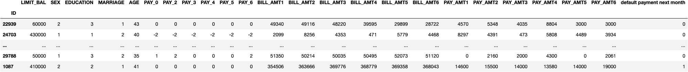
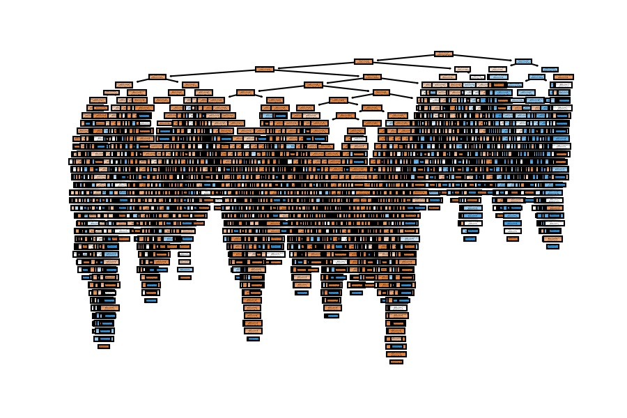
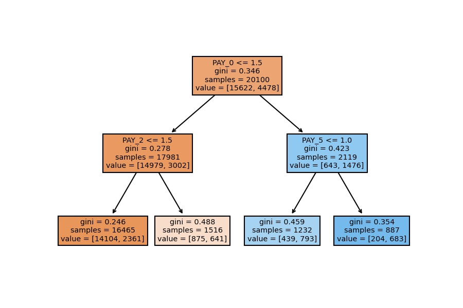
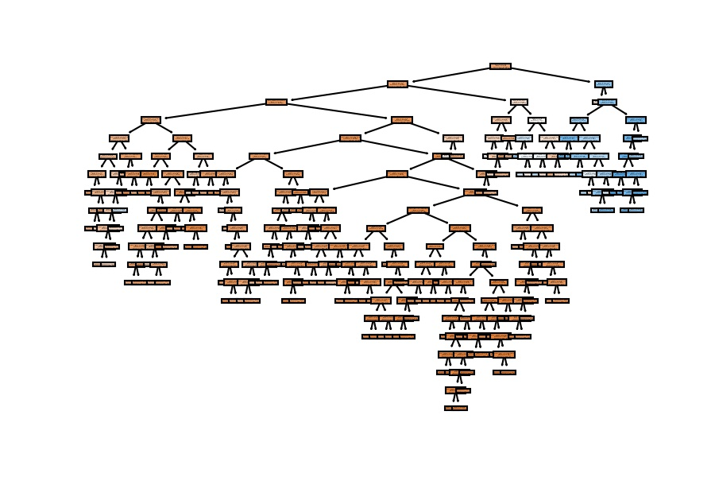
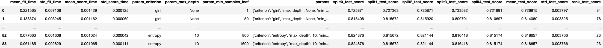
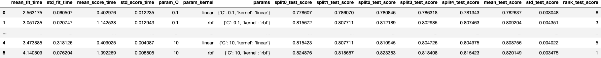
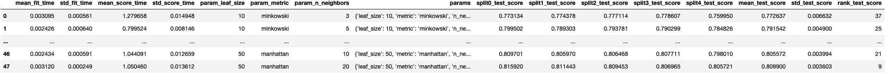

```python
import dataframe_image as dfi
import matplotlib.pyplot as plt
```


**© Jesús López**

Ask him any doubt on **[Twitter](https://twitter.com/jsulopz)** or **[LinkedIn](https://linkedin.com/in/jsulopz)**

# 04 | Hyperparameter Tuning with Cross Validation

## Chapter Importance

We have already covered:

1. Regression Models
2. Classification Models
3. Train Test Split for Model Selection

In short, we have computed all possible types of models to predict numerical and categorical variables with Regression and Classification models, respectively.

Although it is not enough with computing one model, we need to compare different models to choose the one whose predictions are close to reality.

Nevertheless, we cannot evaluate the model on the same data we used to `.fit()` (train) the mathematical equation (model). We need to separate the data into train and test sets; the first to train the model, the later to evaluate the model.

No we add an extra layer of complexity because we can improve a model (an algorithm) by configuring its parameters. This chapter is all about **computing different combinations of a single model's hyperparameters** to get the best.

## Load the [Data](https://www.kaggle.com/datasets/uciml/default-of-credit-card-clients-dataset)

- The goal of this dataset is
- To predict if **bank's customers** (rows) `default` next month
- Based on their **socio-demographical characteristics** (columns)


```python
import pandas as pd
pd.set_option("display.max_columns", None)

url = 'https://archive.ics.uci.edu/ml/machine-learning-databases/00350/default%20of%20credit%20card%20clients.xls'
df_credit = pd.read_excel(io=url, header=1, index_col=0)
df_credit.sample(10)
```



## Preprocess the Data

### Missing Data

The function .fit() all the cells in the DataFrame to contain a value. NaN means "Not a Number" (i.e., cell for which we don't have any information). Otherwise, it won't know how to process the row and compare it to others.


```python
df_credit.isna().sum()
```


    LIMIT_BAL                     0
    SEX                           0
                                 ..
    PAY_AMT6                      0
    default payment next month    0
    Length: 24, dtype: int64


```python
df_credit.isna().sum().sum()
```


    0


### Dummy Variables

The function `.fit()` needs the values to be numeric. Otherwise, Python won't know the position of the axes in which to allocate the point.

Therefore, categories of the categorical columns will be transformed into new columns (one new column per category) and contain 1s and 0s depending on whether the person is or is not in the category.

Nevertheless, **we don't need to create dummy variables** because the data contains numerical variables only.

## Feature Selection

So far, we have used the naming standard of **target** and **features**. Nevertheless, the most common standard we see on Internet is **X** and **y**. Let's get used to it:


```python
y = df_credit.iloc[:, -1]
X = df_credit.iloc[:, :-1]
```

## Train Test Split

From the previous chapter, we should already know we need to separate the data into train and test if we want to evaluate the predictive capability of the model for data we don't know yet.

In our case, we'd like to predict if new credit card customers won't commit default on the next month. As don't have the data for the next month (it's the future), we need to apply the function `train_test_split()`.


```python
from sklearn.model_selection import train_test_split

X_train, X_test, y_train, y_test = train_test_split(
    X, y, test_size=0.33, random_state=42)
```

## `DecisionTreeClassifier()` with Default Hyperparameters

To compute a Machine Learning model with the **default hyperparameters**, we just apply the same procedure we have covered in previous chapters:


```python
from sklearn.tree import DecisionTreeClassifier

model_dt = DecisionTreeClassifier()
model_dt.fit(X_train, y_train)
```


    DecisionTreeClassifier()


### Accuracy

We can see the model is almost perfect to predict the training data (99% of accuracy). Nevertheless, it's really bad to predict test data (72% of accuracy). This phenomena tells us that the model is incurring in **overfitting**.

#### In `train` data


```python
model_dt.score(X_train, y_train)
```


    0.9995024875621891


#### In `test` data


```python
model_dt.score(X_test, y_test)
```


    0.7265656565656565


### Model Visualization

I'll use the following visualization to explain the concept of overfitting.


```python
from sklearn.tree import plot_tree

plot_tree(decision_tree=model_dt, feature_names=X_train.columns, filled=True);
```



The tree is big, really big, because we have many people (20,100) and we haven't set any limit to the model.

How many people do you think we have in the deepest leaf?

- Very few, probably one.

Are these people charasteristic of the overall data? Or are very rare?

- Because they are very rare and the model is very complex, we are incurring on overfitting and we get a huge difference between train and test accuracies.


## `DecisionTreeClassifier()` with Custom Hyperparameters

Which hyperparameters can we configure for the Decision Tree algorithm?

We can see in the output below we can configure parameters such as `max_depth`, `criterion` and `min_samples_leaf`, among others.


```python
model = DecisionTreeClassifier()

model.get_params()
```


    {'ccp_alpha': 0.0,
     'class_weight': None,
     'criterion': 'gini',
     'max_depth': None,
     'max_features': None,
     'max_leaf_nodes': None,
     'min_impurity_decrease': 0.0,
     'min_samples_leaf': 1,
     'min_samples_split': 2,
     'min_weight_fraction_leaf': 0.0,
     'random_state': None,
     'splitter': 'best'}


Let's apply different random configurations to see how to model's accuracy changes in train and test sets.

Pay at the how the accuracies are similar when we reduce the model's complexity (we make the tree shorter and generalized to capture more people in the leafs).

And remember that we should pick up a good configuration based on the test accuracy.

### 1st Configuration


```python
model_dt = DecisionTreeClassifier(max_depth=2, min_samples_leaf=150)
model_dt.fit(X_train, y_train)
```


    DecisionTreeClassifier(max_depth=2, min_samples_leaf=150)


#### Accuracy

##### In `train` data


```python
model_dt.score(X_train, y_train)
```


    0.8186567164179105


##### In `test` data


```python
model_dt.score(X_test, y_test)
```


    0.8215151515151515


#### Model Visualization


```python
plot_tree(decision_tree=model_dt, feature_names=X_train.columns, filled=True);
```



### 2nd Configuration


```python
model_dt = DecisionTreeClassifier(max_depth=3)
model_dt.fit(X_train, y_train)
```


    DecisionTreeClassifier(max_depth=3)


#### Accuracy

##### In `train` data


```python
model_dt.score(X_train, y_train)
```


    0.8207960199004976


##### In `test` data


```python
model_dt.score(X_test, y_test)
```


    0.8222222222222222


#### Model Visualization


```python
plot_tree(decision_tree=model_dt, feature_names=X_train.columns, filled=True);
```


### 3rd Configuration


```python
model_dt = DecisionTreeClassifier(max_depth=4)
model_dt.fit(X_train, y_train)
```


    DecisionTreeClassifier(max_depth=4)


#### Accuracy

##### In `train` data


```python
model_dt.score(X_train, y_train)
```


    0.8232338308457712


##### In `test` data


```python
model_dt.score(X_test, y_test)
```


    0.8205050505050505


#### Model Visualization


```python
plot_tree(decision_tree=model_dt, feature_names=X_train.columns, filled=True);
```


### 4th Configuration

#### Accuracy


```python
model_dt = DecisionTreeClassifier(min_samples_leaf=100)
model_dt.fit(X_train, y_train)
```


    DecisionTreeClassifier(min_samples_leaf=100)


##### In `train` data


```python
model_dt.score(X_train, y_train)
```


    0.8244278606965174


##### In `test` data


```python
model_dt.score(X_test, y_test)
```


    0.8161616161616162


#### Model Visualization


```python
plot_tree(decision_tree=model_dt, feature_names=X_train.columns, filled=True);
```



### 5th Configuration


```python
model_dt = DecisionTreeClassifier(max_depth=7, min_samples_leaf=100)
model_dt.fit(X_train, y_train)
```


    DecisionTreeClassifier(max_depth=7, min_samples_leaf=100)


#### Accuracy

##### In `train` data


```python
model_dt.score(X_train, y_train)
```


    0.8237313432835821


##### In `test` data


```python
model_dt.score(X_test, y_test)
```


    0.8177777777777778


#### Model Visualization


```python
plot_tree(decision_tree=model_dt, feature_names=X_train.columns, filled=True);
```


We have similar results; the accuracy goes around 82% on the test set when we configure a general model which doesn't have a huge depth (as the first one).

But we should be asking ourselves another question: can we do this process of checking multiple combination of hyperparameters automatically?

- Yes, and that's where **Cross Validation** gets in.

## `GridSearchCV()` to find Best Hyperparameters

The Cross Validation technique consists on spliting the training data into n number of folds (5 in the image below) and computing the same model's hyperparameter configuracion n times where each fold will be taken as a test set once.

Take into account that we `.fit()` a model as many times as folds are multiplied by the number of combinations we want to try.


Out of the Decision Tree hyperparameters:


```python
model_dt = DecisionTreeClassifier()

model_dt.get_params()
```


    {'ccp_alpha': 0.0,
     'class_weight': None,
     'criterion': 'gini',
     'max_depth': None,
     'max_features': None,
     'max_leaf_nodes': None,
     'min_impurity_decrease': 0.0,
     'min_samples_leaf': 1,
     'min_samples_split': 2,
     'min_weight_fraction_leaf': 0.0,
     'random_state': None,
     'splitter': 'best'}


We want to try the following combinations of `max_depth (6)`, `min_samples_leaf (7)` and `criterion (2)`:


```python
from sklearn.model_selection import GridSearchCV

param_grid = {
    'max_depth': [None, 2, 3, 4, 5, 10],
    'min_samples_leaf': [1, 50, 100, 200, 400, 800, 1600],
    'criterion': ['gini', 'entropy']
}

cv_dt = GridSearchCV(estimator=model_dt, param_grid=param_grid, cv=5, verbose=1)
```

They make up to 420 times we compute the function`.fit()`


```python
5*6*7*2
```


    420


To compare 84 different combinations of the Decision Tree hyperparameters:


```python
6*7*2
```


    84


```python
cv_dt.fit(X_train, y_train)
```

    Fitting 5 folds for each of 84 candidates, totalling 420 fits


    GridSearchCV(cv=5, estimator=DecisionTreeClassifier(),
                 param_grid={'criterion': ['gini', 'entropy'],
                             'max_depth': [None, 2, 3, 4, 5, 10],
                             'min_samples_leaf': [1, 50, 100, 200, 400, 800, 1600]},
                 verbose=1)


If we specify `verbose=2`, we will see the every fit in the output:


```python
cv_dt = GridSearchCV(estimator=model_dt, param_grid=param_grid, cv=5, verbose=2)
cv_dt.fit(X_train, y_train)
```

    Fitting 5 folds for each of 84 candidates, totalling 420 fits
    [CV] END .criterion=gini, max_depth=None, min_samples_leaf=1; total time=   0.2s
    [CV] END .criterion=gini, max_depth=None, min_samples_leaf=1; total time=   0.2s
    [CV] END .criterion=gini, max_depth=None, min_samples_leaf=1; total time=   0.2s
    [CV] END .criterion=gini, max_depth=None, min_samples_leaf=1; total time=   0.2s
    [CV] END .criterion=gini, max_depth=None, min_samples_leaf=1; total time=   0.2s
    [CV] END criterion=gini, max_depth=None, min_samples_leaf=50; total time=   0.1s
    [CV] END criterion=gini, max_depth=None, min_samples_leaf=50; total time=   0.1s
    [CV] END criterion=gini, max_depth=None, min_samples_leaf=50; total time=   0.1s
    [CV] END criterion=gini, max_depth=None, min_samples_leaf=50; total time=   0.1s
    [CV] END criterion=gini, max_depth=None, min_samples_leaf=50; total time=   0.1s
    [CV] END criterion=gini, max_depth=None, min_samples_leaf=100; total time=   0.1s
    [CV] END criterion=gini, max_depth=None, min_samples_leaf=100; total time=   0.1s
    [CV] END criterion=gini, max_depth=None, min_samples_leaf=100; total time=   0.1s
    [CV] END criterion=gini, max_depth=None, min_samples_leaf=100; total time=   0.1s
    [CV] END criterion=gini, max_depth=None, min_samples_leaf=100; total time=   0.1s
    [CV] END criterion=gini, max_depth=None, min_samples_leaf=200; total time=   0.1s
    [CV] END criterion=gini, max_depth=None, min_samples_leaf=200; total time=   0.1s
    [CV] END criterion=gini, max_depth=None, min_samples_leaf=200; total time=   0.1s
    [CV] END criterion=gini, max_depth=None, min_samples_leaf=200; total time=   0.1s
    [CV] END criterion=gini, max_depth=None, min_samples_leaf=200; total time=   0.1s
    [CV] END criterion=gini, max_depth=None, min_samples_leaf=400; total time=   0.1s
    [CV] END criterion=gini, max_depth=None, min_samples_leaf=400; total time=   0.1s
    [CV] END criterion=gini, max_depth=None, min_samples_leaf=400; total time=   0.1s
    [CV] END criterion=gini, max_depth=None, min_samples_leaf=400; total time=   0.1s
    [CV] END criterion=gini, max_depth=None, min_samples_leaf=400; total time=   0.1s
    [CV] END criterion=gini, max_depth=None, min_samples_leaf=800; total time=   0.1s
    [CV] END criterion=gini, max_depth=None, min_samples_leaf=800; total time=   0.1s
    [CV] END criterion=gini, max_depth=None, min_samples_leaf=800; total time=   0.1s
    [CV] END criterion=gini, max_depth=None, min_samples_leaf=800; total time=   0.1s
    [CV] END criterion=gini, max_depth=None, min_samples_leaf=800; total time=   0.1s
    [CV] END criterion=gini, max_depth=None, min_samples_leaf=1600; total time=   0.1s
    [CV] END criterion=gini, max_depth=None, min_samples_leaf=1600; total time=   0.1s
    [CV] END criterion=gini, max_depth=None, min_samples_leaf=1600; total time=   0.1s
    [CV] END criterion=gini, max_depth=None, min_samples_leaf=1600; total time=   0.1s
    [CV] END criterion=gini, max_depth=None, min_samples_leaf=1600; total time=   0.1s
    [CV] END ....criterion=gini, max_depth=2, min_samples_leaf=1; total time=   0.0s
    [CV] END ....criterion=gini, max_depth=2, min_samples_leaf=1; total time=   0.0s
    [CV] END ....criterion=gini, max_depth=2, min_samples_leaf=1; total time=   0.0s
    [CV] END ....criterion=gini, max_depth=2, min_samples_leaf=1; total time=   0.0s
    [CV] END ....criterion=gini, max_depth=2, min_samples_leaf=1; total time=   0.0s
    [CV] END ...criterion=gini, max_depth=2, min_samples_leaf=50; total time=   0.0s
    [CV] END ...criterion=gini, max_depth=2, min_samples_leaf=50; total time=   0.0s
    [CV] END ...criterion=gini, max_depth=2, min_samples_leaf=50; total time=   0.0s
    [CV] END ...criterion=gini, max_depth=2, min_samples_leaf=50; total time=   0.0s
    [CV] END ...criterion=gini, max_depth=2, min_samples_leaf=50; total time=   0.0s
    [CV] END ..criterion=gini, max_depth=2, min_samples_leaf=100; total time=   0.0s
    [CV] END ..criterion=gini, max_depth=2, min_samples_leaf=100; total time=   0.0s
    [CV] END ..criterion=gini, max_depth=2, min_samples_leaf=100; total time=   0.0s
    [CV] END ..criterion=gini, max_depth=2, min_samples_leaf=100; total time=   0.0s
    [CV] END ..criterion=gini, max_depth=2, min_samples_leaf=100; total time=   0.0s
    [CV] END ..criterion=gini, max_depth=2, min_samples_leaf=200; total time=   0.0s
    [CV] END ..criterion=gini, max_depth=2, min_samples_leaf=200; total time=   0.0s
    [CV] END ..criterion=gini, max_depth=2, min_samples_leaf=200; total time=   0.0s
    [CV] END ..criterion=gini, max_depth=2, min_samples_leaf=200; total time=   0.0s
    [CV] END ..criterion=gini, max_depth=2, min_samples_leaf=200; total time=   0.0s
    [CV] END ..criterion=gini, max_depth=2, min_samples_leaf=400; total time=   0.0s
    [CV] END ..criterion=gini, max_depth=2, min_samples_leaf=400; total time=   0.0s
    [CV] END ..criterion=gini, max_depth=2, min_samples_leaf=400; total time=   0.0s
    [CV] END ..criterion=gini, max_depth=2, min_samples_leaf=400; total time=   0.0s
    [CV] END ..criterion=gini, max_depth=2, min_samples_leaf=400; total time=   0.0s
    [CV] END ..criterion=gini, max_depth=2, min_samples_leaf=800; total time=   0.0s
    [CV] END ..criterion=gini, max_depth=2, min_samples_leaf=800; total time=   0.0s
    [CV] END ..criterion=gini, max_depth=2, min_samples_leaf=800; total time=   0.0s
    [CV] END ..criterion=gini, max_depth=2, min_samples_leaf=800; total time=   0.0s
    [CV] END ..criterion=gini, max_depth=2, min_samples_leaf=800; total time=   0.0s
    [CV] END .criterion=gini, max_depth=2, min_samples_leaf=1600; total time=   0.0s
    [CV] END .criterion=gini, max_depth=2, min_samples_leaf=1600; total time=   0.0s
    [CV] END .criterion=gini, max_depth=2, min_samples_leaf=1600; total time=   0.0s
    [CV] END .criterion=gini, max_depth=2, min_samples_leaf=1600; total time=   0.0s
    [CV] END .criterion=gini, max_depth=2, min_samples_leaf=1600; total time=   0.0s
    [CV] END ....criterion=gini, max_depth=3, min_samples_leaf=1; total time=   0.0s
    [CV] END ....criterion=gini, max_depth=3, min_samples_leaf=1; total time=   0.0s
    [CV] END ....criterion=gini, max_depth=3, min_samples_leaf=1; total time=   0.1s
    [CV] END ....criterion=gini, max_depth=3, min_samples_leaf=1; total time=   0.0s
    [CV] END ....criterion=gini, max_depth=3, min_samples_leaf=1; total time=   0.0s
    [CV] END ...criterion=gini, max_depth=3, min_samples_leaf=50; total time=   0.0s
    [CV] END ...criterion=gini, max_depth=3, min_samples_leaf=50; total time=   0.0s
    [CV] END ...criterion=gini, max_depth=3, min_samples_leaf=50; total time=   0.0s
    [CV] END ...criterion=gini, max_depth=3, min_samples_leaf=50; total time=   0.0s
    [CV] END ...criterion=gini, max_depth=3, min_samples_leaf=50; total time=   0.0s
    [CV] END ..criterion=gini, max_depth=3, min_samples_leaf=100; total time=   0.0s
    [CV] END ..criterion=gini, max_depth=3, min_samples_leaf=100; total time=   0.0s
    [CV] END ..criterion=gini, max_depth=3, min_samples_leaf=100; total time=   0.0s
    [CV] END ..criterion=gini, max_depth=3, min_samples_leaf=100; total time=   0.0s
    [CV] END ..criterion=gini, max_depth=3, min_samples_leaf=100; total time=   0.0s
    [CV] END ..criterion=gini, max_depth=3, min_samples_leaf=200; total time=   0.0s
    [CV] END ..criterion=gini, max_depth=3, min_samples_leaf=200; total time=   0.0s
    [CV] END ..criterion=gini, max_depth=3, min_samples_leaf=200; total time=   0.0s
    [CV] END ..criterion=gini, max_depth=3, min_samples_leaf=200; total time=   0.0s
    [CV] END ..criterion=gini, max_depth=3, min_samples_leaf=200; total time=   0.0s
    [CV] END ..criterion=gini, max_depth=3, min_samples_leaf=400; total time=   0.0s
    [CV] END ..criterion=gini, max_depth=3, min_samples_leaf=400; total time=   0.0s
    [CV] END ..criterion=gini, max_depth=3, min_samples_leaf=400; total time=   0.0s
    [CV] END ..criterion=gini, max_depth=3, min_samples_leaf=400; total time=   0.0s
    [CV] END ..criterion=gini, max_depth=3, min_samples_leaf=400; total time=   0.0s
    [CV] END ..criterion=gini, max_depth=3, min_samples_leaf=800; total time=   0.0s
    [CV] END ..criterion=gini, max_depth=3, min_samples_leaf=800; total time=   0.0s
    [CV] END ..criterion=gini, max_depth=3, min_samples_leaf=800; total time=   0.0s
    [CV] END ..criterion=gini, max_depth=3, min_samples_leaf=800; total time=   0.0s
    [CV] END ..criterion=gini, max_depth=3, min_samples_leaf=800; total time=   0.0s
    [CV] END .criterion=gini, max_depth=3, min_samples_leaf=1600; total time=   0.0s
    [CV] END .criterion=gini, max_depth=3, min_samples_leaf=1600; total time=   0.0s
    [CV] END .criterion=gini, max_depth=3, min_samples_leaf=1600; total time=   0.0s
    [CV] END .criterion=gini, max_depth=3, min_samples_leaf=1600; total time=   0.0s
    [CV] END .criterion=gini, max_depth=3, min_samples_leaf=1600; total time=   0.0s
    [CV] END ....criterion=gini, max_depth=4, min_samples_leaf=1; total time=   0.1s
    [CV] END ....criterion=gini, max_depth=4, min_samples_leaf=1; total time=   0.1s
    [CV] END ....criterion=gini, max_depth=4, min_samples_leaf=1; total time=   0.1s
    [CV] END ....criterion=gini, max_depth=4, min_samples_leaf=1; total time=   0.1s
    [CV] END ....criterion=gini, max_depth=4, min_samples_leaf=1; total time=   0.1s
    [CV] END ...criterion=gini, max_depth=4, min_samples_leaf=50; total time=   0.1s
    [CV] END ...criterion=gini, max_depth=4, min_samples_leaf=50; total time=   0.1s
    [CV] END ...criterion=gini, max_depth=4, min_samples_leaf=50; total time=   0.1s
    [CV] END ...criterion=gini, max_depth=4, min_samples_leaf=50; total time=   0.1s
    [CV] END ...criterion=gini, max_depth=4, min_samples_leaf=50; total time=   0.1s
    [CV] END ..criterion=gini, max_depth=4, min_samples_leaf=100; total time=   0.1s
    [CV] END ..criterion=gini, max_depth=4, min_samples_leaf=100; total time=   0.1s
    [CV] END ..criterion=gini, max_depth=4, min_samples_leaf=100; total time=   0.1s
    [CV] END ..criterion=gini, max_depth=4, min_samples_leaf=100; total time=   0.1s
    [CV] END ..criterion=gini, max_depth=4, min_samples_leaf=100; total time=   0.1s
    [CV] END ..criterion=gini, max_depth=4, min_samples_leaf=200; total time=   0.1s
    [CV] END ..criterion=gini, max_depth=4, min_samples_leaf=200; total time=   0.1s
    [CV] END ..criterion=gini, max_depth=4, min_samples_leaf=200; total time=   0.1s
    [CV] END ..criterion=gini, max_depth=4, min_samples_leaf=200; total time=   0.1s
    [CV] END ..criterion=gini, max_depth=4, min_samples_leaf=200; total time=   0.1s
    [CV] END ..criterion=gini, max_depth=4, min_samples_leaf=400; total time=   0.1s
    [CV] END ..criterion=gini, max_depth=4, min_samples_leaf=400; total time=   0.1s
    [CV] END ..criterion=gini, max_depth=4, min_samples_leaf=400; total time=   0.1s
    [CV] END ..criterion=gini, max_depth=4, min_samples_leaf=400; total time=   0.1s
    [CV] END ..criterion=gini, max_depth=4, min_samples_leaf=400; total time=   0.1s
    [CV] END ..criterion=gini, max_depth=4, min_samples_leaf=800; total time=   0.1s
    [CV] END ..criterion=gini, max_depth=4, min_samples_leaf=800; total time=   0.1s
    [CV] END ..criterion=gini, max_depth=4, min_samples_leaf=800; total time=   0.0s
    [CV] END ..criterion=gini, max_depth=4, min_samples_leaf=800; total time=   0.0s
    [CV] END ..criterion=gini, max_depth=4, min_samples_leaf=800; total time=   0.1s
    [CV] END .criterion=gini, max_depth=4, min_samples_leaf=1600; total time=   0.0s
    [CV] END .criterion=gini, max_depth=4, min_samples_leaf=1600; total time=   0.0s
    [CV] END .criterion=gini, max_depth=4, min_samples_leaf=1600; total time=   0.0s
    [CV] END .criterion=gini, max_depth=4, min_samples_leaf=1600; total time=   0.0s
    [CV] END .criterion=gini, max_depth=4, min_samples_leaf=1600; total time=   0.0s
    [CV] END ....criterion=gini, max_depth=5, min_samples_leaf=1; total time=   0.1s
    [CV] END ....criterion=gini, max_depth=5, min_samples_leaf=1; total time=   0.1s
    [CV] END ....criterion=gini, max_depth=5, min_samples_leaf=1; total time=   0.1s
    [CV] END ....criterion=gini, max_depth=5, min_samples_leaf=1; total time=   0.1s
    [CV] END ....criterion=gini, max_depth=5, min_samples_leaf=1; total time=   0.1s
    [CV] END ...criterion=gini, max_depth=5, min_samples_leaf=50; total time=   0.1s
    [CV] END ...criterion=gini, max_depth=5, min_samples_leaf=50; total time=   0.1s
    [CV] END ...criterion=gini, max_depth=5, min_samples_leaf=50; total time=   0.1s
    [CV] END ...criterion=gini, max_depth=5, min_samples_leaf=50; total time=   0.1s
    [CV] END ...criterion=gini, max_depth=5, min_samples_leaf=50; total time=   0.1s
    [CV] END ..criterion=gini, max_depth=5, min_samples_leaf=100; total time=   0.1s
    [CV] END ..criterion=gini, max_depth=5, min_samples_leaf=100; total time=   0.1s
    [CV] END ..criterion=gini, max_depth=5, min_samples_leaf=100; total time=   0.1s
    [CV] END ..criterion=gini, max_depth=5, min_samples_leaf=100; total time=   0.1s
    [CV] END ..criterion=gini, max_depth=5, min_samples_leaf=100; total time=   0.1s
    [CV] END ..criterion=gini, max_depth=5, min_samples_leaf=200; total time=   0.1s
    [CV] END ..criterion=gini, max_depth=5, min_samples_leaf=200; total time=   0.1s
    [CV] END ..criterion=gini, max_depth=5, min_samples_leaf=200; total time=   0.1s
    [CV] END ..criterion=gini, max_depth=5, min_samples_leaf=200; total time=   0.1s
    [CV] END ..criterion=gini, max_depth=5, min_samples_leaf=200; total time=   0.1s
    [CV] END ..criterion=gini, max_depth=5, min_samples_leaf=400; total time=   0.1s
    [CV] END ..criterion=gini, max_depth=5, min_samples_leaf=400; total time=   0.1s
    [CV] END ..criterion=gini, max_depth=5, min_samples_leaf=400; total time=   0.1s
    [CV] END ..criterion=gini, max_depth=5, min_samples_leaf=400; total time=   0.1s
    [CV] END ..criterion=gini, max_depth=5, min_samples_leaf=400; total time=   0.1s
    [CV] END ..criterion=gini, max_depth=5, min_samples_leaf=800; total time=   0.1s
    [CV] END ..criterion=gini, max_depth=5, min_samples_leaf=800; total time=   0.1s
    [CV] END ..criterion=gini, max_depth=5, min_samples_leaf=800; total time=   0.1s
    [CV] END ..criterion=gini, max_depth=5, min_samples_leaf=800; total time=   0.1s
    [CV] END ..criterion=gini, max_depth=5, min_samples_leaf=800; total time=   0.1s
    [CV] END .criterion=gini, max_depth=5, min_samples_leaf=1600; total time=   0.1s
    [CV] END .criterion=gini, max_depth=5, min_samples_leaf=1600; total time=   0.1s
    [CV] END .criterion=gini, max_depth=5, min_samples_leaf=1600; total time=   0.1s
    [CV] END .criterion=gini, max_depth=5, min_samples_leaf=1600; total time=   0.1s
    [CV] END .criterion=gini, max_depth=5, min_samples_leaf=1600; total time=   0.1s
    [CV] END ...criterion=gini, max_depth=10, min_samples_leaf=1; total time=   0.1s
    [CV] END ...criterion=gini, max_depth=10, min_samples_leaf=1; total time=   0.1s
    [CV] END ...criterion=gini, max_depth=10, min_samples_leaf=1; total time=   0.1s
    [CV] END ...criterion=gini, max_depth=10, min_samples_leaf=1; total time=   0.1s
    [CV] END ...criterion=gini, max_depth=10, min_samples_leaf=1; total time=   0.1s
    [CV] END ..criterion=gini, max_depth=10, min_samples_leaf=50; total time=   0.1s
    [CV] END ..criterion=gini, max_depth=10, min_samples_leaf=50; total time=   0.1s
    [CV] END ..criterion=gini, max_depth=10, min_samples_leaf=50; total time=   0.1s
    [CV] END ..criterion=gini, max_depth=10, min_samples_leaf=50; total time=   0.1s
    [CV] END ..criterion=gini, max_depth=10, min_samples_leaf=50; total time=   0.1s
    [CV] END .criterion=gini, max_depth=10, min_samples_leaf=100; total time=   0.1s
    [CV] END .criterion=gini, max_depth=10, min_samples_leaf=100; total time=   0.1s
    [CV] END .criterion=gini, max_depth=10, min_samples_leaf=100; total time=   0.1s
    [CV] END .criterion=gini, max_depth=10, min_samples_leaf=100; total time=   0.1s
    [CV] END .criterion=gini, max_depth=10, min_samples_leaf=100; total time=   0.1s
    [CV] END .criterion=gini, max_depth=10, min_samples_leaf=200; total time=   0.1s
    [CV] END .criterion=gini, max_depth=10, min_samples_leaf=200; total time=   0.1s
    [CV] END .criterion=gini, max_depth=10, min_samples_leaf=200; total time=   0.1s
    [CV] END .criterion=gini, max_depth=10, min_samples_leaf=200; total time=   0.1s
    [CV] END .criterion=gini, max_depth=10, min_samples_leaf=200; total time=   0.1s
    [CV] END .criterion=gini, max_depth=10, min_samples_leaf=400; total time=   0.1s
    [CV] END .criterion=gini, max_depth=10, min_samples_leaf=400; total time=   0.1s
    [CV] END .criterion=gini, max_depth=10, min_samples_leaf=400; total time=   0.1s
    [CV] END .criterion=gini, max_depth=10, min_samples_leaf=400; total time=   0.1s
    [CV] END .criterion=gini, max_depth=10, min_samples_leaf=400; total time=   0.1s
    [CV] END .criterion=gini, max_depth=10, min_samples_leaf=800; total time=   0.1s
    [CV] END .criterion=gini, max_depth=10, min_samples_leaf=800; total time=   0.1s
    [CV] END .criterion=gini, max_depth=10, min_samples_leaf=800; total time=   0.1s
    [CV] END .criterion=gini, max_depth=10, min_samples_leaf=800; total time=   0.1s
    [CV] END .criterion=gini, max_depth=10, min_samples_leaf=800; total time=   0.1s
    [CV] END criterion=gini, max_depth=10, min_samples_leaf=1600; total time=   0.1s
    [CV] END criterion=gini, max_depth=10, min_samples_leaf=1600; total time=   0.1s
    [CV] END criterion=gini, max_depth=10, min_samples_leaf=1600; total time=   0.1s
    [CV] END criterion=gini, max_depth=10, min_samples_leaf=1600; total time=   0.1s
    [CV] END criterion=gini, max_depth=10, min_samples_leaf=1600; total time=   0.1s
    [CV] END criterion=entropy, max_depth=None, min_samples_leaf=1; total time=   0.2s
    [CV] END criterion=entropy, max_depth=None, min_samples_leaf=1; total time=   0.2s
    [CV] END criterion=entropy, max_depth=None, min_samples_leaf=1; total time=   0.2s
    [CV] END criterion=entropy, max_depth=None, min_samples_leaf=1; total time=   0.2s
    [CV] END criterion=entropy, max_depth=None, min_samples_leaf=1; total time=   0.2s
    [CV] END criterion=entropy, max_depth=None, min_samples_leaf=50; total time=   0.1s
    [CV] END criterion=entropy, max_depth=None, min_samples_leaf=50; total time=   0.1s
    [CV] END criterion=entropy, max_depth=None, min_samples_leaf=50; total time=   0.1s
    [CV] END criterion=entropy, max_depth=None, min_samples_leaf=50; total time=   0.2s
    [CV] END criterion=entropy, max_depth=None, min_samples_leaf=50; total time=   0.2s
    [CV] END criterion=entropy, max_depth=None, min_samples_leaf=100; total time=   0.1s
    [CV] END criterion=entropy, max_depth=None, min_samples_leaf=100; total time=   0.1s
    [CV] END criterion=entropy, max_depth=None, min_samples_leaf=100; total time=   0.1s
    [CV] END criterion=entropy, max_depth=None, min_samples_leaf=100; total time=   0.1s
    [CV] END criterion=entropy, max_depth=None, min_samples_leaf=100; total time=   0.1s
    [CV] END criterion=entropy, max_depth=None, min_samples_leaf=200; total time=   0.1s
    [CV] END criterion=entropy, max_depth=None, min_samples_leaf=200; total time=   0.1s
    [CV] END criterion=entropy, max_depth=None, min_samples_leaf=200; total time=   0.1s
    [CV] END criterion=entropy, max_depth=None, min_samples_leaf=200; total time=   0.1s
    [CV] END criterion=entropy, max_depth=None, min_samples_leaf=200; total time=   0.1s
    [CV] END criterion=entropy, max_depth=None, min_samples_leaf=400; total time=   0.1s
    [CV] END criterion=entropy, max_depth=None, min_samples_leaf=400; total time=   0.1s
    [CV] END criterion=entropy, max_depth=None, min_samples_leaf=400; total time=   0.1s
    [CV] END criterion=entropy, max_depth=None, min_samples_leaf=400; total time=   0.1s
    [CV] END criterion=entropy, max_depth=None, min_samples_leaf=400; total time=   0.1s
    [CV] END criterion=entropy, max_depth=None, min_samples_leaf=800; total time=   0.1s
    [CV] END criterion=entropy, max_depth=None, min_samples_leaf=800; total time=   0.1s
    [CV] END criterion=entropy, max_depth=None, min_samples_leaf=800; total time=   0.1s
    [CV] END criterion=entropy, max_depth=None, min_samples_leaf=800; total time=   0.1s
    [CV] END criterion=entropy, max_depth=None, min_samples_leaf=800; total time=   0.1s
    [CV] END criterion=entropy, max_depth=None, min_samples_leaf=1600; total time=   0.1s
    [CV] END criterion=entropy, max_depth=None, min_samples_leaf=1600; total time=   0.1s
    [CV] END criterion=entropy, max_depth=None, min_samples_leaf=1600; total time=   0.1s
    [CV] END criterion=entropy, max_depth=None, min_samples_leaf=1600; total time=   0.1s
    [CV] END criterion=entropy, max_depth=None, min_samples_leaf=1600; total time=   0.1s
    [CV] END .criterion=entropy, max_depth=2, min_samples_leaf=1; total time=   0.0s
    [CV] END .criterion=entropy, max_depth=2, min_samples_leaf=1; total time=   0.0s
    [CV] END .criterion=entropy, max_depth=2, min_samples_leaf=1; total time=   0.0s
    [CV] END .criterion=entropy, max_depth=2, min_samples_leaf=1; total time=   0.0s
    [CV] END .criterion=entropy, max_depth=2, min_samples_leaf=1; total time=   0.0s
    [CV] END criterion=entropy, max_depth=2, min_samples_leaf=50; total time=   0.0s
    [CV] END criterion=entropy, max_depth=2, min_samples_leaf=50; total time=   0.0s
    [CV] END criterion=entropy, max_depth=2, min_samples_leaf=50; total time=   0.0s
    [CV] END criterion=entropy, max_depth=2, min_samples_leaf=50; total time=   0.0s
    [CV] END criterion=entropy, max_depth=2, min_samples_leaf=50; total time=   0.0s
    [CV] END criterion=entropy, max_depth=2, min_samples_leaf=100; total time=   0.0s
    [CV] END criterion=entropy, max_depth=2, min_samples_leaf=100; total time=   0.0s
    [CV] END criterion=entropy, max_depth=2, min_samples_leaf=100; total time=   0.0s
    [CV] END criterion=entropy, max_depth=2, min_samples_leaf=100; total time=   0.0s
    [CV] END criterion=entropy, max_depth=2, min_samples_leaf=100; total time=   0.0s
    [CV] END criterion=entropy, max_depth=2, min_samples_leaf=200; total time=   0.0s
    [CV] END criterion=entropy, max_depth=2, min_samples_leaf=200; total time=   0.0s
    [CV] END criterion=entropy, max_depth=2, min_samples_leaf=200; total time=   0.0s
    [CV] END criterion=entropy, max_depth=2, min_samples_leaf=200; total time=   0.0s
    [CV] END criterion=entropy, max_depth=2, min_samples_leaf=200; total time=   0.0s
    [CV] END criterion=entropy, max_depth=2, min_samples_leaf=400; total time=   0.0s
    [CV] END criterion=entropy, max_depth=2, min_samples_leaf=400; total time=   0.0s
    [CV] END criterion=entropy, max_depth=2, min_samples_leaf=400; total time=   0.0s
    [CV] END criterion=entropy, max_depth=2, min_samples_leaf=400; total time=   0.0s
    [CV] END criterion=entropy, max_depth=2, min_samples_leaf=400; total time=   0.0s
    [CV] END criterion=entropy, max_depth=2, min_samples_leaf=800; total time=   0.0s
    [CV] END criterion=entropy, max_depth=2, min_samples_leaf=800; total time=   0.0s
    [CV] END criterion=entropy, max_depth=2, min_samples_leaf=800; total time=   0.0s
    [CV] END criterion=entropy, max_depth=2, min_samples_leaf=800; total time=   0.0s
    [CV] END criterion=entropy, max_depth=2, min_samples_leaf=800; total time=   0.0s
    [CV] END criterion=entropy, max_depth=2, min_samples_leaf=1600; total time=   0.0s
    [CV] END criterion=entropy, max_depth=2, min_samples_leaf=1600; total time=   0.0s
    [CV] END criterion=entropy, max_depth=2, min_samples_leaf=1600; total time=   0.0s
    [CV] END criterion=entropy, max_depth=2, min_samples_leaf=1600; total time=   0.0s
    [CV] END criterion=entropy, max_depth=2, min_samples_leaf=1600; total time=   0.0s
    [CV] END .criterion=entropy, max_depth=3, min_samples_leaf=1; total time=   0.0s
    [CV] END .criterion=entropy, max_depth=3, min_samples_leaf=1; total time=   0.0s
    [CV] END .criterion=entropy, max_depth=3, min_samples_leaf=1; total time=   0.0s
    [CV] END .criterion=entropy, max_depth=3, min_samples_leaf=1; total time=   0.0s
    [CV] END .criterion=entropy, max_depth=3, min_samples_leaf=1; total time=   0.0s
    [CV] END criterion=entropy, max_depth=3, min_samples_leaf=50; total time=   0.0s
    [CV] END criterion=entropy, max_depth=3, min_samples_leaf=50; total time=   0.0s
    [CV] END criterion=entropy, max_depth=3, min_samples_leaf=50; total time=   0.0s
    [CV] END criterion=entropy, max_depth=3, min_samples_leaf=50; total time=   0.0s
    [CV] END criterion=entropy, max_depth=3, min_samples_leaf=50; total time=   0.0s
    [CV] END criterion=entropy, max_depth=3, min_samples_leaf=100; total time=   0.0s
    [CV] END criterion=entropy, max_depth=3, min_samples_leaf=100; total time=   0.0s
    [CV] END criterion=entropy, max_depth=3, min_samples_leaf=100; total time=   0.0s
    [CV] END criterion=entropy, max_depth=3, min_samples_leaf=100; total time=   0.0s
    [CV] END criterion=entropy, max_depth=3, min_samples_leaf=100; total time=   0.0s
    [CV] END criterion=entropy, max_depth=3, min_samples_leaf=200; total time=   0.0s
    [CV] END criterion=entropy, max_depth=3, min_samples_leaf=200; total time=   0.0s
    [CV] END criterion=entropy, max_depth=3, min_samples_leaf=200; total time=   0.0s
    [CV] END criterion=entropy, max_depth=3, min_samples_leaf=200; total time=   0.0s
    [CV] END criterion=entropy, max_depth=3, min_samples_leaf=200; total time=   0.0s
    [CV] END criterion=entropy, max_depth=3, min_samples_leaf=400; total time=   0.0s
    [CV] END criterion=entropy, max_depth=3, min_samples_leaf=400; total time=   0.0s
    [CV] END criterion=entropy, max_depth=3, min_samples_leaf=400; total time=   0.0s
    [CV] END criterion=entropy, max_depth=3, min_samples_leaf=400; total time=   0.0s
    [CV] END criterion=entropy, max_depth=3, min_samples_leaf=400; total time=   0.0s
    [CV] END criterion=entropy, max_depth=3, min_samples_leaf=800; total time=   0.0s
    [CV] END criterion=entropy, max_depth=3, min_samples_leaf=800; total time=   0.0s
    [CV] END criterion=entropy, max_depth=3, min_samples_leaf=800; total time=   0.0s
    [CV] END criterion=entropy, max_depth=3, min_samples_leaf=800; total time=   0.0s
    [CV] END criterion=entropy, max_depth=3, min_samples_leaf=800; total time=   0.0s
    [CV] END criterion=entropy, max_depth=3, min_samples_leaf=1600; total time=   0.0s
    [CV] END criterion=entropy, max_depth=3, min_samples_leaf=1600; total time=   0.0s
    [CV] END criterion=entropy, max_depth=3, min_samples_leaf=1600; total time=   0.0s
    [CV] END criterion=entropy, max_depth=3, min_samples_leaf=1600; total time=   0.0s
    [CV] END criterion=entropy, max_depth=3, min_samples_leaf=1600; total time=   0.0s
    [CV] END .criterion=entropy, max_depth=4, min_samples_leaf=1; total time=   0.1s
    [CV] END .criterion=entropy, max_depth=4, min_samples_leaf=1; total time=   0.1s
    [CV] END .criterion=entropy, max_depth=4, min_samples_leaf=1; total time=   0.1s
    [CV] END .criterion=entropy, max_depth=4, min_samples_leaf=1; total time=   0.1s
    [CV] END .criterion=entropy, max_depth=4, min_samples_leaf=1; total time=   0.1s
    [CV] END criterion=entropy, max_depth=4, min_samples_leaf=50; total time=   0.1s
    [CV] END criterion=entropy, max_depth=4, min_samples_leaf=50; total time=   0.1s
    [CV] END criterion=entropy, max_depth=4, min_samples_leaf=50; total time=   0.1s
    [CV] END criterion=entropy, max_depth=4, min_samples_leaf=50; total time=   0.1s
    [CV] END criterion=entropy, max_depth=4, min_samples_leaf=50; total time=   0.1s
    [CV] END criterion=entropy, max_depth=4, min_samples_leaf=100; total time=   0.1s
    [CV] END criterion=entropy, max_depth=4, min_samples_leaf=100; total time=   0.1s
    [CV] END criterion=entropy, max_depth=4, min_samples_leaf=100; total time=   0.1s
    [CV] END criterion=entropy, max_depth=4, min_samples_leaf=100; total time=   0.1s
    [CV] END criterion=entropy, max_depth=4, min_samples_leaf=100; total time=   0.1s
    [CV] END criterion=entropy, max_depth=4, min_samples_leaf=200; total time=   0.1s
    [CV] END criterion=entropy, max_depth=4, min_samples_leaf=200; total time=   0.1s
    [CV] END criterion=entropy, max_depth=4, min_samples_leaf=200; total time=   0.1s
    [CV] END criterion=entropy, max_depth=4, min_samples_leaf=200; total time=   0.1s
    [CV] END criterion=entropy, max_depth=4, min_samples_leaf=200; total time=   0.1s
    [CV] END criterion=entropy, max_depth=4, min_samples_leaf=400; total time=   0.1s
    [CV] END criterion=entropy, max_depth=4, min_samples_leaf=400; total time=   0.1s
    [CV] END criterion=entropy, max_depth=4, min_samples_leaf=400; total time=   0.1s
    [CV] END criterion=entropy, max_depth=4, min_samples_leaf=400; total time=   0.1s
    [CV] END criterion=entropy, max_depth=4, min_samples_leaf=400; total time=   0.1s
    [CV] END criterion=entropy, max_depth=4, min_samples_leaf=800; total time=   0.1s
    [CV] END criterion=entropy, max_depth=4, min_samples_leaf=800; total time=   0.1s
    [CV] END criterion=entropy, max_depth=4, min_samples_leaf=800; total time=   0.1s
    [CV] END criterion=entropy, max_depth=4, min_samples_leaf=800; total time=   0.1s
    [CV] END criterion=entropy, max_depth=4, min_samples_leaf=800; total time=   0.1s
    [CV] END criterion=entropy, max_depth=4, min_samples_leaf=1600; total time=   0.1s
    [CV] END criterion=entropy, max_depth=4, min_samples_leaf=1600; total time=   0.1s
    [CV] END criterion=entropy, max_depth=4, min_samples_leaf=1600; total time=   0.1s
    [CV] END criterion=entropy, max_depth=4, min_samples_leaf=1600; total time=   0.1s
    [CV] END criterion=entropy, max_depth=4, min_samples_leaf=1600; total time=   0.1s
    [CV] END .criterion=entropy, max_depth=5, min_samples_leaf=1; total time=   0.1s
    [CV] END .criterion=entropy, max_depth=5, min_samples_leaf=1; total time=   0.1s
    [CV] END .criterion=entropy, max_depth=5, min_samples_leaf=1; total time=   0.1s
    [CV] END .criterion=entropy, max_depth=5, min_samples_leaf=1; total time=   0.1s
    [CV] END .criterion=entropy, max_depth=5, min_samples_leaf=1; total time=   0.1s
    [CV] END criterion=entropy, max_depth=5, min_samples_leaf=50; total time=   0.1s
    [CV] END criterion=entropy, max_depth=5, min_samples_leaf=50; total time=   0.1s
    [CV] END criterion=entropy, max_depth=5, min_samples_leaf=50; total time=   0.1s
    [CV] END criterion=entropy, max_depth=5, min_samples_leaf=50; total time=   0.1s
    [CV] END criterion=entropy, max_depth=5, min_samples_leaf=50; total time=   0.1s
    [CV] END criterion=entropy, max_depth=5, min_samples_leaf=100; total time=   0.1s
    [CV] END criterion=entropy, max_depth=5, min_samples_leaf=100; total time=   0.1s
    [CV] END criterion=entropy, max_depth=5, min_samples_leaf=100; total time=   0.1s
    [CV] END criterion=entropy, max_depth=5, min_samples_leaf=100; total time=   0.1s
    [CV] END criterion=entropy, max_depth=5, min_samples_leaf=100; total time=   0.1s
    [CV] END criterion=entropy, max_depth=5, min_samples_leaf=200; total time=   0.1s
    [CV] END criterion=entropy, max_depth=5, min_samples_leaf=200; total time=   0.1s
    [CV] END criterion=entropy, max_depth=5, min_samples_leaf=200; total time=   0.1s
    [CV] END criterion=entropy, max_depth=5, min_samples_leaf=200; total time=   0.1s
    [CV] END criterion=entropy, max_depth=5, min_samples_leaf=200; total time=   0.1s
    [CV] END criterion=entropy, max_depth=5, min_samples_leaf=400; total time=   0.1s
    [CV] END criterion=entropy, max_depth=5, min_samples_leaf=400; total time=   0.1s
    [CV] END criterion=entropy, max_depth=5, min_samples_leaf=400; total time=   0.1s
    [CV] END criterion=entropy, max_depth=5, min_samples_leaf=400; total time=   0.1s
    [CV] END criterion=entropy, max_depth=5, min_samples_leaf=400; total time=   0.1s
    [CV] END criterion=entropy, max_depth=5, min_samples_leaf=800; total time=   0.1s
    [CV] END criterion=entropy, max_depth=5, min_samples_leaf=800; total time=   0.1s
    [CV] END criterion=entropy, max_depth=5, min_samples_leaf=800; total time=   0.1s
    [CV] END criterion=entropy, max_depth=5, min_samples_leaf=800; total time=   0.1s
    [CV] END criterion=entropy, max_depth=5, min_samples_leaf=800; total time=   0.1s
    [CV] END criterion=entropy, max_depth=5, min_samples_leaf=1600; total time=   0.1s
    [CV] END criterion=entropy, max_depth=5, min_samples_leaf=1600; total time=   0.1s
    [CV] END criterion=entropy, max_depth=5, min_samples_leaf=1600; total time=   0.1s
    [CV] END criterion=entropy, max_depth=5, min_samples_leaf=1600; total time=   0.1s
    [CV] END criterion=entropy, max_depth=5, min_samples_leaf=1600; total time=   0.1s
    [CV] END criterion=entropy, max_depth=10, min_samples_leaf=1; total time=   0.1s
    [CV] END criterion=entropy, max_depth=10, min_samples_leaf=1; total time=   0.1s
    [CV] END criterion=entropy, max_depth=10, min_samples_leaf=1; total time=   0.1s
    [CV] END criterion=entropy, max_depth=10, min_samples_leaf=1; total time=   0.1s
    [CV] END criterion=entropy, max_depth=10, min_samples_leaf=1; total time=   0.1s
    [CV] END criterion=entropy, max_depth=10, min_samples_leaf=50; total time=   0.1s
    [CV] END criterion=entropy, max_depth=10, min_samples_leaf=50; total time=   0.1s
    [CV] END criterion=entropy, max_depth=10, min_samples_leaf=50; total time=   0.1s
    [CV] END criterion=entropy, max_depth=10, min_samples_leaf=50; total time=   0.1s
    [CV] END criterion=entropy, max_depth=10, min_samples_leaf=50; total time=   0.1s
    [CV] END criterion=entropy, max_depth=10, min_samples_leaf=100; total time=   0.1s
    [CV] END criterion=entropy, max_depth=10, min_samples_leaf=100; total time=   0.1s
    [CV] END criterion=entropy, max_depth=10, min_samples_leaf=100; total time=   0.1s
    [CV] END criterion=entropy, max_depth=10, min_samples_leaf=100; total time=   0.1s
    [CV] END criterion=entropy, max_depth=10, min_samples_leaf=100; total time=   0.1s
    [CV] END criterion=entropy, max_depth=10, min_samples_leaf=200; total time=   0.1s
    [CV] END criterion=entropy, max_depth=10, min_samples_leaf=200; total time=   0.1s
    [CV] END criterion=entropy, max_depth=10, min_samples_leaf=200; total time=   0.1s
    [CV] END criterion=entropy, max_depth=10, min_samples_leaf=200; total time=   0.1s
    [CV] END criterion=entropy, max_depth=10, min_samples_leaf=200; total time=   0.1s
    [CV] END criterion=entropy, max_depth=10, min_samples_leaf=400; total time=   0.1s
    [CV] END criterion=entropy, max_depth=10, min_samples_leaf=400; total time=   0.1s
    [CV] END criterion=entropy, max_depth=10, min_samples_leaf=400; total time=   0.1s
    [CV] END criterion=entropy, max_depth=10, min_samples_leaf=400; total time=   0.1s
    [CV] END criterion=entropy, max_depth=10, min_samples_leaf=400; total time=   0.1s
    [CV] END criterion=entropy, max_depth=10, min_samples_leaf=800; total time=   0.1s
    [CV] END criterion=entropy, max_depth=10, min_samples_leaf=800; total time=   0.1s
    [CV] END criterion=entropy, max_depth=10, min_samples_leaf=800; total time=   0.1s
    [CV] END criterion=entropy, max_depth=10, min_samples_leaf=800; total time=   0.1s
    [CV] END criterion=entropy, max_depth=10, min_samples_leaf=800; total time=   0.1s
    [CV] END criterion=entropy, max_depth=10, min_samples_leaf=1600; total time=   0.1s
    [CV] END criterion=entropy, max_depth=10, min_samples_leaf=1600; total time=   0.1s
    [CV] END criterion=entropy, max_depth=10, min_samples_leaf=1600; total time=   0.1s
    [CV] END criterion=entropy, max_depth=10, min_samples_leaf=1600; total time=   0.1s
    [CV] END criterion=entropy, max_depth=10, min_samples_leaf=1600; total time=   0.1s


    GridSearchCV(cv=5, estimator=DecisionTreeClassifier(),
                 param_grid={'criterion': ['gini', 'entropy'],
                             'max_depth': [None, 2, 3, 4, 5, 10],
                             'min_samples_leaf': [1, 50, 100, 200, 400, 800, 1600]},
                 verbose=2)


The best hyperparameter configuration is:


```python
cv_dt.best_estimator_
```


    DecisionTreeClassifier(criterion='entropy', max_depth=5, min_samples_leaf=100)


To achieve an accuracy on the test set of:


```python
cv_dt.score(X_test, y_test)
```


    0.8186868686868687


If we'd like to have the results of every configuracion:


```python
df_cv_dt = pd.DataFrame(cv.cv_results_)
df_cv_dt
```



## Other Models

Now let's try to find the best hyperparameter configuration of other models, which don't have the same hyperparameters than the Decision Tree because their algorithm and mathematical equation are different.

### Support Vector Machines `SVC()`


```python
%%HTML
<iframe width="560" height="315" src="https://www.youtube.com/embed/efR1C6CvhmE" title="YouTube video player" frameborder="0" allow="accelerometer; autoplay; clipboard-write; encrypted-media; gyroscope; picture-in-picture" allowfullscreen></iframe>
```


Before computing the Support Vector Machines model, we need to scale the data because this model compares the distance between the explanatory variables and they all need to be on the same scale.


```python
from sklearn.preprocessing import MinMaxScaler

scaler = MinMaxScaler()

X_norm = pd.DataFrame(scaler.fit_transform(X), columns=X.columns)
```

We need to separate the data again to have the train and test sets with the scaled data:


```python
>>> X_norm_train, X_norm_test, y_train, y_test = train_test_split(
...     X_norm, y, test_size=0.33, random_state=42)
```

The Support Vector Machines contains the following hyperparameters:


```python
from sklearn.svm import SVC

sv = SVC()
sv.get_params()
```


    {'C': 1.0,
     'break_ties': False,
     'cache_size': 200,
     'class_weight': None,
     'coef0': 0.0,
     'decision_function_shape': 'ovr',
     'degree': 3,
     'gamma': 'scale',
     'kernel': 'rbf',
     'max_iter': -1,
     'probability': False,
     'random_state': None,
     'shrinking': True,
     'tol': 0.001,
     'verbose': False}


From which we want to try the following combinations:


```python
param_grid = {
    'C': [0.1, 1, 10],
    'kernel': ['linear', 'rbf']
}

cv_sv = GridSearchCV(estimator=sv, param_grid=param_grid, verbose=2)
cv_sv.fit(X_norm_train, y_train)
```

    Fitting 5 folds for each of 6 candidates, totalling 30 fits
    [CV] END ...............................C=0.1, kernel=linear; total time=   3.0s
    [CV] END ...............................C=0.1, kernel=linear; total time=   3.0s
    [CV] END ...............................C=0.1, kernel=linear; total time=   2.9s
    [CV] END ...............................C=0.1, kernel=linear; total time=   3.1s
    [CV] END ...............................C=0.1, kernel=linear; total time=   2.9s
    [CV] END ..................................C=0.1, kernel=rbf; total time=   4.2s
    [CV] END ..................................C=0.1, kernel=rbf; total time=   4.2s
    [CV] END ..................................C=0.1, kernel=rbf; total time=   4.2s
    [CV] END ..................................C=0.1, kernel=rbf; total time=   4.2s
    [CV] END ..................................C=0.1, kernel=rbf; total time=   4.2s
    [CV] END .................................C=1, kernel=linear; total time=   3.0s
    [CV] END .................................C=1, kernel=linear; total time=   3.1s
    [CV] END .................................C=1, kernel=linear; total time=   3.1s
    [CV] END .................................C=1, kernel=linear; total time=   3.3s
    [CV] END .................................C=1, kernel=linear; total time=   3.1s
    [CV] END ....................................C=1, kernel=rbf; total time=   4.6s
    [CV] END ....................................C=1, kernel=rbf; total time=   4.5s
    [CV] END ....................................C=1, kernel=rbf; total time=   4.5s
    [CV] END ....................................C=1, kernel=rbf; total time=   4.6s
    [CV] END ....................................C=1, kernel=rbf; total time=   4.6s
    [CV] END ................................C=10, kernel=linear; total time=   3.8s
    [CV] END ................................C=10, kernel=linear; total time=   3.9s
    [CV] END ................................C=10, kernel=linear; total time=   3.6s
    [CV] END ................................C=10, kernel=linear; total time=   4.6s
    [CV] END ................................C=10, kernel=linear; total time=   3.9s
    [CV] END ...................................C=10, kernel=rbf; total time=   5.3s
    [CV] END ...................................C=10, kernel=rbf; total time=   5.1s
    [CV] END ...................................C=10, kernel=rbf; total time=   5.3s
    [CV] END ...................................C=10, kernel=rbf; total time=   5.3s
    [CV] END ...................................C=10, kernel=rbf; total time=   5.3s


    GridSearchCV(estimator=SVC(),
                 param_grid={'C': [0.1, 1, 10], 'kernel': ['linear', 'rbf']},
                 verbose=2)


We should notice that some fits take up to almost 5 seconds, which is very time-expensive if we want to try thousands of different combinations (professionals apply these practices). Therefore, we should know how the model's algorithm works inside to choose a good hyperparameter configuration that doesn't devore a lot of time. Otherwise, we make the company spend a lot of money in computing power.

[This tutorial](https://jakevdp.github.io/PythonDataScienceHandbook/05.07-support-vector-machines.html) disects very well how the Support Vector Machines algorithm works inside.

The best hyperparameter configuration is:


```python
cv_sv.best_estimator_
```


    SVC(C=10)


To achieve an accuracy on the test set of:


```python
cv_sv.score(X_norm_test, y_test)
```


    0.8185858585858586


If we'd like to have the results of every configuracion:


```python
df_cv_sv = pd.DataFrame(cv_sv.cv_results_)
df_cv_sv
```



## `KNeighborsClassifier()`

Now we'll compute another classification model: K Nearest Neighbours.


```python
%%HTML
<iframe width="560" height="315" src="https://www.youtube.com/embed/HVXime0nQeI" title="YouTube video player" frameborder="0" allow="accelerometer; autoplay; clipboard-write; encrypted-media; gyroscope; picture-in-picture" allowfullscreen></iframe>
```


We check for its hyperparameters:


```python
from sklearn.neighbors import KNeighborsClassifier

kn = KNeighborsClassifier()
kn.get_params()
```


    {'algorithm': 'auto',
     'leaf_size': 30,
     'metric': 'minkowski',
     'metric_params': None,
     'n_jobs': None,
     'n_neighbors': 5,
     'p': 2,
     'weights': 'uniform'}


To choose the following combinations:


```python
param_grid = {
    'leaf_size': [10, 20, 30, 50],
    'metric': ['minkowski', 'euclidean', 'manhattan'],
    'n_neighbors': [3, 5, 10, 20]
}

cv_kn = GridSearchCV(estimator=kn, param_grid=param_grid, verbose=2)
cv_kn.fit(X_norm_train, y_train)
```

    Fitting 5 folds for each of 48 candidates, totalling 240 fits
    [CV] END ......leaf_size=10, metric=minkowski, n_neighbors=3; total time=   1.5s
    [CV] END ......leaf_size=10, metric=minkowski, n_neighbors=3; total time=   1.3s
    [CV] END ......leaf_size=10, metric=minkowski, n_neighbors=3; total time=   1.3s
    [CV] END ......leaf_size=10, metric=minkowski, n_neighbors=3; total time=   1.3s
    [CV] END ......leaf_size=10, metric=minkowski, n_neighbors=3; total time=   1.3s
    [CV] END ......leaf_size=10, metric=minkowski, n_neighbors=5; total time=   0.8s
    [CV] END ......leaf_size=10, metric=minkowski, n_neighbors=5; total time=   0.8s
    [CV] END ......leaf_size=10, metric=minkowski, n_neighbors=5; total time=   0.8s
    [CV] END ......leaf_size=10, metric=minkowski, n_neighbors=5; total time=   0.8s
    [CV] END ......leaf_size=10, metric=minkowski, n_neighbors=5; total time=   0.8s
    [CV] END .....leaf_size=10, metric=minkowski, n_neighbors=10; total time=   0.8s
    [CV] END .....leaf_size=10, metric=minkowski, n_neighbors=10; total time=   0.8s
    [CV] END .....leaf_size=10, metric=minkowski, n_neighbors=10; total time=   0.8s
    [CV] END .....leaf_size=10, metric=minkowski, n_neighbors=10; total time=   0.8s
    [CV] END .....leaf_size=10, metric=minkowski, n_neighbors=10; total time=   0.8s
    [CV] END .....leaf_size=10, metric=minkowski, n_neighbors=20; total time=   0.8s
    [CV] END .....leaf_size=10, metric=minkowski, n_neighbors=20; total time=   0.8s
    [CV] END .....leaf_size=10, metric=minkowski, n_neighbors=20; total time=   0.8s
    [CV] END .....leaf_size=10, metric=minkowski, n_neighbors=20; total time=   0.8s
    [CV] END .....leaf_size=10, metric=minkowski, n_neighbors=20; total time=   0.8s
    [CV] END ......leaf_size=10, metric=euclidean, n_neighbors=3; total time=   1.3s
    [CV] END ......leaf_size=10, metric=euclidean, n_neighbors=3; total time=   1.3s
    [CV] END ......leaf_size=10, metric=euclidean, n_neighbors=3; total time=   1.3s
    [CV] END ......leaf_size=10, metric=euclidean, n_neighbors=3; total time=   1.3s
    [CV] END ......leaf_size=10, metric=euclidean, n_neighbors=3; total time=   1.3s
    [CV] END ......leaf_size=10, metric=euclidean, n_neighbors=5; total time=   0.8s
    [CV] END ......leaf_size=10, metric=euclidean, n_neighbors=5; total time=   0.9s
    [CV] END ......leaf_size=10, metric=euclidean, n_neighbors=5; total time=   0.8s
    [CV] END ......leaf_size=10, metric=euclidean, n_neighbors=5; total time=   0.9s
    [CV] END ......leaf_size=10, metric=euclidean, n_neighbors=5; total time=   0.9s
    [CV] END .....leaf_size=10, metric=euclidean, n_neighbors=10; total time=   0.8s
    [CV] END .....leaf_size=10, metric=euclidean, n_neighbors=10; total time=   0.8s
    [CV] END .....leaf_size=10, metric=euclidean, n_neighbors=10; total time=   0.8s
    [CV] END .....leaf_size=10, metric=euclidean, n_neighbors=10; total time=   0.8s
    [CV] END .....leaf_size=10, metric=euclidean, n_neighbors=10; total time=   0.8s
    [CV] END .....leaf_size=10, metric=euclidean, n_neighbors=20; total time=   0.8s
    [CV] END .....leaf_size=10, metric=euclidean, n_neighbors=20; total time=   0.8s
    [CV] END .....leaf_size=10, metric=euclidean, n_neighbors=20; total time=   0.8s
    [CV] END .....leaf_size=10, metric=euclidean, n_neighbors=20; total time=   0.8s
    [CV] END .....leaf_size=10, metric=euclidean, n_neighbors=20; total time=   0.8s
    [CV] END ......leaf_size=10, metric=manhattan, n_neighbors=3; total time=   1.5s
    [CV] END ......leaf_size=10, metric=manhattan, n_neighbors=3; total time=   1.5s
    [CV] END ......leaf_size=10, metric=manhattan, n_neighbors=3; total time=   1.5s
    [CV] END ......leaf_size=10, metric=manhattan, n_neighbors=3; total time=   1.5s
    [CV] END ......leaf_size=10, metric=manhattan, n_neighbors=3; total time=   1.5s
    [CV] END ......leaf_size=10, metric=manhattan, n_neighbors=5; total time=   1.1s
    [CV] END ......leaf_size=10, metric=manhattan, n_neighbors=5; total time=   1.1s
    [CV] END ......leaf_size=10, metric=manhattan, n_neighbors=5; total time=   1.1s
    [CV] END ......leaf_size=10, metric=manhattan, n_neighbors=5; total time=   1.0s
    [CV] END ......leaf_size=10, metric=manhattan, n_neighbors=5; total time=   1.0s
    [CV] END .....leaf_size=10, metric=manhattan, n_neighbors=10; total time=   1.1s
    [CV] END .....leaf_size=10, metric=manhattan, n_neighbors=10; total time=   1.1s
    [CV] END .....leaf_size=10, metric=manhattan, n_neighbors=10; total time=   1.1s
    [CV] END .....leaf_size=10, metric=manhattan, n_neighbors=10; total time=   1.1s
    [CV] END .....leaf_size=10, metric=manhattan, n_neighbors=10; total time=   1.0s
    [CV] END .....leaf_size=10, metric=manhattan, n_neighbors=20; total time=   1.1s
    [CV] END .....leaf_size=10, metric=manhattan, n_neighbors=20; total time=   1.1s
    [CV] END .....leaf_size=10, metric=manhattan, n_neighbors=20; total time=   1.1s
    [CV] END .....leaf_size=10, metric=manhattan, n_neighbors=20; total time=   1.0s
    [CV] END .....leaf_size=10, metric=manhattan, n_neighbors=20; total time=   1.1s
    [CV] END ......leaf_size=20, metric=minkowski, n_neighbors=3; total time=   1.3s
    [CV] END ......leaf_size=20, metric=minkowski, n_neighbors=3; total time=   1.3s
    [CV] END ......leaf_size=20, metric=minkowski, n_neighbors=3; total time=   1.3s
    [CV] END ......leaf_size=20, metric=minkowski, n_neighbors=3; total time=   1.3s
    [CV] END ......leaf_size=20, metric=minkowski, n_neighbors=3; total time=   1.3s
    [CV] END ......leaf_size=20, metric=minkowski, n_neighbors=5; total time=   0.8s
    [CV] END ......leaf_size=20, metric=minkowski, n_neighbors=5; total time=   0.8s
    [CV] END ......leaf_size=20, metric=minkowski, n_neighbors=5; total time=   0.8s
    [CV] END ......leaf_size=20, metric=minkowski, n_neighbors=5; total time=   0.8s
    [CV] END ......leaf_size=20, metric=minkowski, n_neighbors=5; total time=   0.8s
    [CV] END .....leaf_size=20, metric=minkowski, n_neighbors=10; total time=   0.8s
    [CV] END .....leaf_size=20, metric=minkowski, n_neighbors=10; total time=   0.8s
    [CV] END .....leaf_size=20, metric=minkowski, n_neighbors=10; total time=   0.8s
    [CV] END .....leaf_size=20, metric=minkowski, n_neighbors=10; total time=   0.8s
    [CV] END .....leaf_size=20, metric=minkowski, n_neighbors=10; total time=   0.8s
    [CV] END .....leaf_size=20, metric=minkowski, n_neighbors=20; total time=   0.8s
    [CV] END .....leaf_size=20, metric=minkowski, n_neighbors=20; total time=   0.8s
    [CV] END .....leaf_size=20, metric=minkowski, n_neighbors=20; total time=   0.8s
    [CV] END .....leaf_size=20, metric=minkowski, n_neighbors=20; total time=   0.8s
    [CV] END .....leaf_size=20, metric=minkowski, n_neighbors=20; total time=   0.8s
    [CV] END ......leaf_size=20, metric=euclidean, n_neighbors=3; total time=   1.3s
    [CV] END ......leaf_size=20, metric=euclidean, n_neighbors=3; total time=   1.3s
    [CV] END ......leaf_size=20, metric=euclidean, n_neighbors=3; total time=   1.3s
    [CV] END ......leaf_size=20, metric=euclidean, n_neighbors=3; total time=   1.3s
    [CV] END ......leaf_size=20, metric=euclidean, n_neighbors=3; total time=   1.3s
    [CV] END ......leaf_size=20, metric=euclidean, n_neighbors=5; total time=   0.8s
    [CV] END ......leaf_size=20, metric=euclidean, n_neighbors=5; total time=   0.8s
    [CV] END ......leaf_size=20, metric=euclidean, n_neighbors=5; total time=   0.8s
    [CV] END ......leaf_size=20, metric=euclidean, n_neighbors=5; total time=   0.8s
    [CV] END ......leaf_size=20, metric=euclidean, n_neighbors=5; total time=   0.8s
    [CV] END .....leaf_size=20, metric=euclidean, n_neighbors=10; total time=   0.8s
    [CV] END .....leaf_size=20, metric=euclidean, n_neighbors=10; total time=   0.8s
    [CV] END .....leaf_size=20, metric=euclidean, n_neighbors=10; total time=   0.8s
    [CV] END .....leaf_size=20, metric=euclidean, n_neighbors=10; total time=   0.8s
    [CV] END .....leaf_size=20, metric=euclidean, n_neighbors=10; total time=   0.8s
    [CV] END .....leaf_size=20, metric=euclidean, n_neighbors=20; total time=   0.9s
    [CV] END .....leaf_size=20, metric=euclidean, n_neighbors=20; total time=   0.8s
    [CV] END .....leaf_size=20, metric=euclidean, n_neighbors=20; total time=   0.9s
    [CV] END .....leaf_size=20, metric=euclidean, n_neighbors=20; total time=   0.8s
    [CV] END .....leaf_size=20, metric=euclidean, n_neighbors=20; total time=   0.8s
    [CV] END ......leaf_size=20, metric=manhattan, n_neighbors=3; total time=   1.5s
    [CV] END ......leaf_size=20, metric=manhattan, n_neighbors=3; total time=   1.5s
    [CV] END ......leaf_size=20, metric=manhattan, n_neighbors=3; total time=   1.6s
    [CV] END ......leaf_size=20, metric=manhattan, n_neighbors=3; total time=   1.6s
    [CV] END ......leaf_size=20, metric=manhattan, n_neighbors=3; total time=   1.5s
    [CV] END ......leaf_size=20, metric=manhattan, n_neighbors=5; total time=   1.1s
    [CV] END ......leaf_size=20, metric=manhattan, n_neighbors=5; total time=   1.1s
    [CV] END ......leaf_size=20, metric=manhattan, n_neighbors=5; total time=   1.1s
    [CV] END ......leaf_size=20, metric=manhattan, n_neighbors=5; total time=   1.1s
    [CV] END ......leaf_size=20, metric=manhattan, n_neighbors=5; total time=   1.0s
    [CV] END .....leaf_size=20, metric=manhattan, n_neighbors=10; total time=   1.1s
    [CV] END .....leaf_size=20, metric=manhattan, n_neighbors=10; total time=   1.1s
    [CV] END .....leaf_size=20, metric=manhattan, n_neighbors=10; total time=   1.1s
    [CV] END .....leaf_size=20, metric=manhattan, n_neighbors=10; total time=   1.1s
    [CV] END .....leaf_size=20, metric=manhattan, n_neighbors=10; total time=   1.1s
    [CV] END .....leaf_size=20, metric=manhattan, n_neighbors=20; total time=   1.1s
    [CV] END .....leaf_size=20, metric=manhattan, n_neighbors=20; total time=   1.1s
    [CV] END .....leaf_size=20, metric=manhattan, n_neighbors=20; total time=   1.1s
    [CV] END .....leaf_size=20, metric=manhattan, n_neighbors=20; total time=   1.1s
    [CV] END .....leaf_size=20, metric=manhattan, n_neighbors=20; total time=   1.1s
    [CV] END ......leaf_size=30, metric=minkowski, n_neighbors=3; total time=   1.3s
    [CV] END ......leaf_size=30, metric=minkowski, n_neighbors=3; total time=   1.3s
    [CV] END ......leaf_size=30, metric=minkowski, n_neighbors=3; total time=   1.3s
    [CV] END ......leaf_size=30, metric=minkowski, n_neighbors=3; total time=   1.3s
    [CV] END ......leaf_size=30, metric=minkowski, n_neighbors=3; total time=   1.3s
    [CV] END ......leaf_size=30, metric=minkowski, n_neighbors=5; total time=   0.8s
    [CV] END ......leaf_size=30, metric=minkowski, n_neighbors=5; total time=   0.8s
    [CV] END ......leaf_size=30, metric=minkowski, n_neighbors=5; total time=   0.8s
    [CV] END ......leaf_size=30, metric=minkowski, n_neighbors=5; total time=   0.8s
    [CV] END ......leaf_size=30, metric=minkowski, n_neighbors=5; total time=   0.8s
    [CV] END .....leaf_size=30, metric=minkowski, n_neighbors=10; total time=   0.8s
    [CV] END .....leaf_size=30, metric=minkowski, n_neighbors=10; total time=   0.8s
    [CV] END .....leaf_size=30, metric=minkowski, n_neighbors=10; total time=   0.8s
    [CV] END .....leaf_size=30, metric=minkowski, n_neighbors=10; total time=   0.8s
    [CV] END .....leaf_size=30, metric=minkowski, n_neighbors=10; total time=   0.8s
    [CV] END .....leaf_size=30, metric=minkowski, n_neighbors=20; total time=   0.8s
    [CV] END .....leaf_size=30, metric=minkowski, n_neighbors=20; total time=   0.8s
    [CV] END .....leaf_size=30, metric=minkowski, n_neighbors=20; total time=   0.8s
    [CV] END .....leaf_size=30, metric=minkowski, n_neighbors=20; total time=   0.8s
    [CV] END .....leaf_size=30, metric=minkowski, n_neighbors=20; total time=   0.8s
    [CV] END ......leaf_size=30, metric=euclidean, n_neighbors=3; total time=   1.3s
    [CV] END ......leaf_size=30, metric=euclidean, n_neighbors=3; total time=   1.3s
    [CV] END ......leaf_size=30, metric=euclidean, n_neighbors=3; total time=   1.3s
    [CV] END ......leaf_size=30, metric=euclidean, n_neighbors=3; total time=   1.3s
    [CV] END ......leaf_size=30, metric=euclidean, n_neighbors=3; total time=   1.3s
    [CV] END ......leaf_size=30, metric=euclidean, n_neighbors=5; total time=   0.8s
    [CV] END ......leaf_size=30, metric=euclidean, n_neighbors=5; total time=   0.8s
    [CV] END ......leaf_size=30, metric=euclidean, n_neighbors=5; total time=   0.8s
    [CV] END ......leaf_size=30, metric=euclidean, n_neighbors=5; total time=   0.8s
    [CV] END ......leaf_size=30, metric=euclidean, n_neighbors=5; total time=   0.8s
    [CV] END .....leaf_size=30, metric=euclidean, n_neighbors=10; total time=   0.8s
    [CV] END .....leaf_size=30, metric=euclidean, n_neighbors=10; total time=   0.8s
    [CV] END .....leaf_size=30, metric=euclidean, n_neighbors=10; total time=   0.8s
    [CV] END .....leaf_size=30, metric=euclidean, n_neighbors=10; total time=   0.8s
    [CV] END .....leaf_size=30, metric=euclidean, n_neighbors=10; total time=   0.8s
    [CV] END .....leaf_size=30, metric=euclidean, n_neighbors=20; total time=   0.8s
    [CV] END .....leaf_size=30, metric=euclidean, n_neighbors=20; total time=   0.8s
    [CV] END .....leaf_size=30, metric=euclidean, n_neighbors=20; total time=   0.9s
    [CV] END .....leaf_size=30, metric=euclidean, n_neighbors=20; total time=   0.8s
    [CV] END .....leaf_size=30, metric=euclidean, n_neighbors=20; total time=   0.8s
    [CV] END ......leaf_size=30, metric=manhattan, n_neighbors=3; total time=   1.5s
    [CV] END ......leaf_size=30, metric=manhattan, n_neighbors=3; total time=   1.5s
    [CV] END ......leaf_size=30, metric=manhattan, n_neighbors=3; total time=   1.5s
    [CV] END ......leaf_size=30, metric=manhattan, n_neighbors=3; total time=   1.5s
    [CV] END ......leaf_size=30, metric=manhattan, n_neighbors=3; total time=   1.5s
    [CV] END ......leaf_size=30, metric=manhattan, n_neighbors=5; total time=   1.1s
    [CV] END ......leaf_size=30, metric=manhattan, n_neighbors=5; total time=   1.1s
    [CV] END ......leaf_size=30, metric=manhattan, n_neighbors=5; total time=   1.1s
    [CV] END ......leaf_size=30, metric=manhattan, n_neighbors=5; total time=   1.1s
    [CV] END ......leaf_size=30, metric=manhattan, n_neighbors=5; total time=   1.0s
    [CV] END .....leaf_size=30, metric=manhattan, n_neighbors=10; total time=   1.1s
    [CV] END .....leaf_size=30, metric=manhattan, n_neighbors=10; total time=   1.1s
    [CV] END .....leaf_size=30, metric=manhattan, n_neighbors=10; total time=   1.1s
    [CV] END .....leaf_size=30, metric=manhattan, n_neighbors=10; total time=   1.1s
    [CV] END .....leaf_size=30, metric=manhattan, n_neighbors=10; total time=   1.1s
    [CV] END .....leaf_size=30, metric=manhattan, n_neighbors=20; total time=   1.1s
    [CV] END .....leaf_size=30, metric=manhattan, n_neighbors=20; total time=   1.1s
    [CV] END .....leaf_size=30, metric=manhattan, n_neighbors=20; total time=   1.1s
    [CV] END .....leaf_size=30, metric=manhattan, n_neighbors=20; total time=   1.1s
    [CV] END .....leaf_size=30, metric=manhattan, n_neighbors=20; total time=   1.1s
    [CV] END ......leaf_size=50, metric=minkowski, n_neighbors=3; total time=   1.3s
    [CV] END ......leaf_size=50, metric=minkowski, n_neighbors=3; total time=   1.3s
    [CV] END ......leaf_size=50, metric=minkowski, n_neighbors=3; total time=   1.3s
    [CV] END ......leaf_size=50, metric=minkowski, n_neighbors=3; total time=   1.3s
    [CV] END ......leaf_size=50, metric=minkowski, n_neighbors=3; total time=   1.3s
    [CV] END ......leaf_size=50, metric=minkowski, n_neighbors=5; total time=   0.8s
    [CV] END ......leaf_size=50, metric=minkowski, n_neighbors=5; total time=   0.8s
    [CV] END ......leaf_size=50, metric=minkowski, n_neighbors=5; total time=   0.8s
    [CV] END ......leaf_size=50, metric=minkowski, n_neighbors=5; total time=   0.8s
    [CV] END ......leaf_size=50, metric=minkowski, n_neighbors=5; total time=   0.8s
    [CV] END .....leaf_size=50, metric=minkowski, n_neighbors=10; total time=   0.8s
    [CV] END .....leaf_size=50, metric=minkowski, n_neighbors=10; total time=   0.8s
    [CV] END .....leaf_size=50, metric=minkowski, n_neighbors=10; total time=   0.8s
    [CV] END .....leaf_size=50, metric=minkowski, n_neighbors=10; total time=   0.8s
    [CV] END .....leaf_size=50, metric=minkowski, n_neighbors=10; total time=   0.8s
    [CV] END .....leaf_size=50, metric=minkowski, n_neighbors=20; total time=   0.8s
    [CV] END .....leaf_size=50, metric=minkowski, n_neighbors=20; total time=   0.8s
    [CV] END .....leaf_size=50, metric=minkowski, n_neighbors=20; total time=   0.8s
    [CV] END .....leaf_size=50, metric=minkowski, n_neighbors=20; total time=   0.8s
    [CV] END .....leaf_size=50, metric=minkowski, n_neighbors=20; total time=   0.8s
    [CV] END ......leaf_size=50, metric=euclidean, n_neighbors=3; total time=   1.3s
    [CV] END ......leaf_size=50, metric=euclidean, n_neighbors=3; total time=   1.3s
    [CV] END ......leaf_size=50, metric=euclidean, n_neighbors=3; total time=   1.3s
    [CV] END ......leaf_size=50, metric=euclidean, n_neighbors=3; total time=   1.3s
    [CV] END ......leaf_size=50, metric=euclidean, n_neighbors=3; total time=   1.3s
    [CV] END ......leaf_size=50, metric=euclidean, n_neighbors=5; total time=   0.8s
    [CV] END ......leaf_size=50, metric=euclidean, n_neighbors=5; total time=   0.8s
    [CV] END ......leaf_size=50, metric=euclidean, n_neighbors=5; total time=   0.8s
    [CV] END ......leaf_size=50, metric=euclidean, n_neighbors=5; total time=   0.8s
    [CV] END ......leaf_size=50, metric=euclidean, n_neighbors=5; total time=   0.8s
    [CV] END .....leaf_size=50, metric=euclidean, n_neighbors=10; total time=   0.8s
    [CV] END .....leaf_size=50, metric=euclidean, n_neighbors=10; total time=   0.8s
    [CV] END .....leaf_size=50, metric=euclidean, n_neighbors=10; total time=   0.8s
    [CV] END .....leaf_size=50, metric=euclidean, n_neighbors=10; total time=   0.8s
    [CV] END .....leaf_size=50, metric=euclidean, n_neighbors=10; total time=   0.8s
    [CV] END .....leaf_size=50, metric=euclidean, n_neighbors=20; total time=   0.8s
    [CV] END .....leaf_size=50, metric=euclidean, n_neighbors=20; total time=   0.8s
    [CV] END .....leaf_size=50, metric=euclidean, n_neighbors=20; total time=   0.8s
    [CV] END .....leaf_size=50, metric=euclidean, n_neighbors=20; total time=   0.8s
    [CV] END .....leaf_size=50, metric=euclidean, n_neighbors=20; total time=   0.8s
    [CV] END ......leaf_size=50, metric=manhattan, n_neighbors=3; total time=   1.5s
    [CV] END ......leaf_size=50, metric=manhattan, n_neighbors=3; total time=   1.5s
    [CV] END ......leaf_size=50, metric=manhattan, n_neighbors=3; total time=   1.5s
    [CV] END ......leaf_size=50, metric=manhattan, n_neighbors=3; total time=   1.5s
    [CV] END ......leaf_size=50, metric=manhattan, n_neighbors=3; total time=   1.5s
    [CV] END ......leaf_size=50, metric=manhattan, n_neighbors=5; total time=   1.1s
    [CV] END ......leaf_size=50, metric=manhattan, n_neighbors=5; total time=   1.1s
    [CV] END ......leaf_size=50, metric=manhattan, n_neighbors=5; total time=   1.1s
    [CV] END ......leaf_size=50, metric=manhattan, n_neighbors=5; total time=   1.1s
    [CV] END ......leaf_size=50, metric=manhattan, n_neighbors=5; total time=   1.0s
    [CV] END .....leaf_size=50, metric=manhattan, n_neighbors=10; total time=   1.1s
    [CV] END .....leaf_size=50, metric=manhattan, n_neighbors=10; total time=   1.1s
    [CV] END .....leaf_size=50, metric=manhattan, n_neighbors=10; total time=   1.1s
    [CV] END .....leaf_size=50, metric=manhattan, n_neighbors=10; total time=   1.1s
    [CV] END .....leaf_size=50, metric=manhattan, n_neighbors=10; total time=   1.0s
    [CV] END .....leaf_size=50, metric=manhattan, n_neighbors=20; total time=   1.1s
    [CV] END .....leaf_size=50, metric=manhattan, n_neighbors=20; total time=   1.1s
    [CV] END .....leaf_size=50, metric=manhattan, n_neighbors=20; total time=   1.1s
    [CV] END .....leaf_size=50, metric=manhattan, n_neighbors=20; total time=   1.1s
    [CV] END .....leaf_size=50, metric=manhattan, n_neighbors=20; total time=   1.1s


    GridSearchCV(estimator=KNeighborsClassifier(),
                 param_grid={'leaf_size': [10, 20, 30, 50],
                             'metric': ['minkowski', 'euclidean', 'manhattan'],
                             'n_neighbors': [3, 5, 10, 20]},
                 verbose=2)


The best hyperparameter configuration is:


```python
cv_kn.best_estimator_
```


    SVC(C=10)


To achieve an accuracy on the test set of:


```python
cv_kn.score(X_norm_test, y_test)
```


    0.8185858585858586


If we'd like to have the results of every configuracion:


```python
df_cv_kn = pd.DataFrame(cv_kn.cv_results_)
df_cv_kn
```



## Best Model with Best Hyperparameters

The best algorithm at their best is the Decision Tree Classifier:


```python
dic_results = {
    'model': [
        cv_dt.best_estimator_,
        cv_sv.best_estimator_,
        cv_kn.best_estimator_
    ],
    
    'score': [
        cv_dt.score(X_test, y_test),
        cv_sv.score(X_norm_test, y_test),
        cv_kn.score(X_norm_test, y_test)
    ]
}

df_cv_comp = pd.DataFrame(dic_results)
df_cv_comp.style.background_gradient()
```


<a rel="license" href="http://creativecommons.org/licenses/by-nc-nd/4.0/"></a><br />This work is licensed under a <a rel="license" href="http://creativecommons.org/licenses/by-nc-nd/4.0/">Creative Commons Attribution-NonCommercial-NoDerivatives 4.0 International License</a>.
