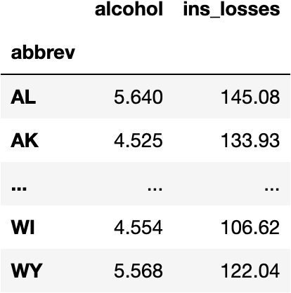
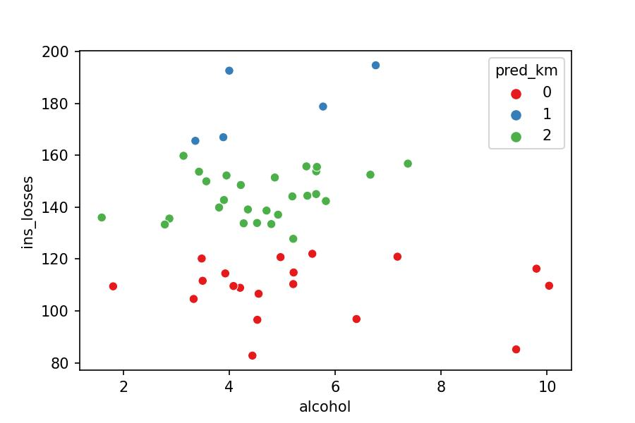
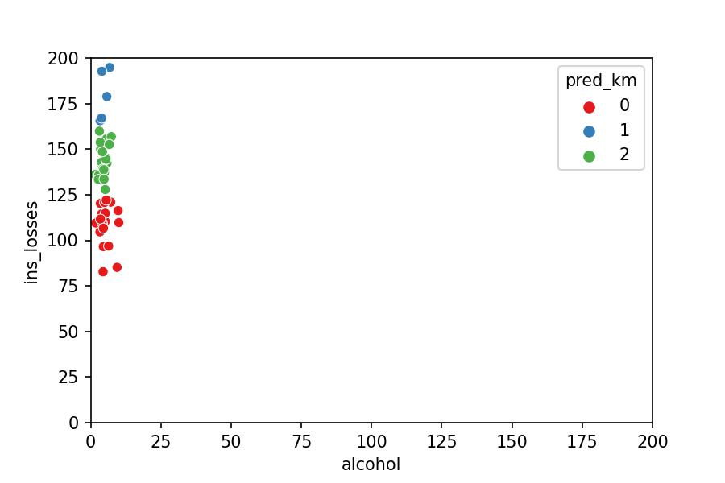
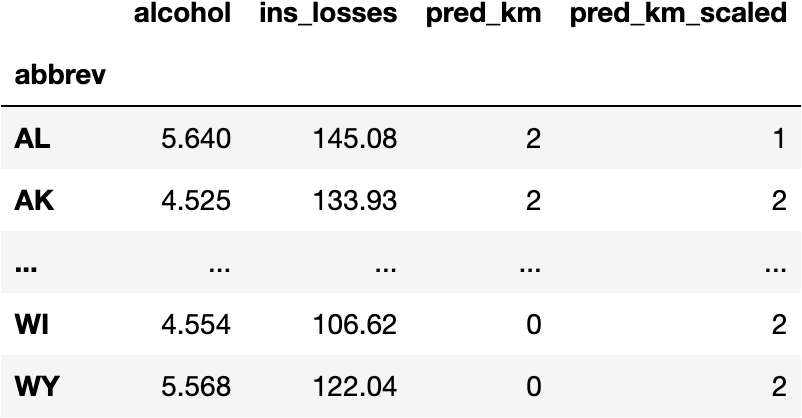
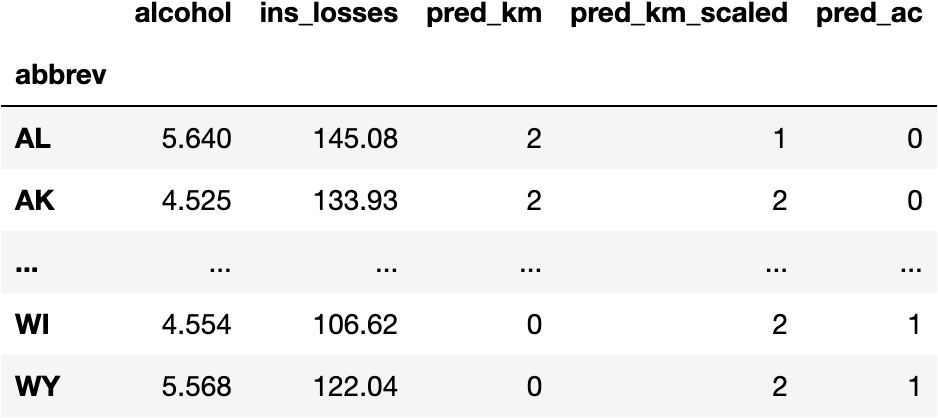
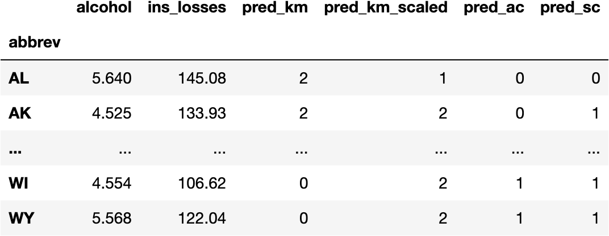
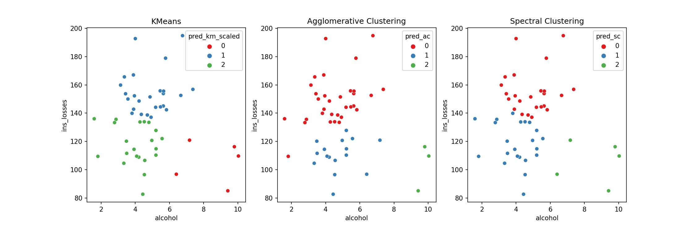
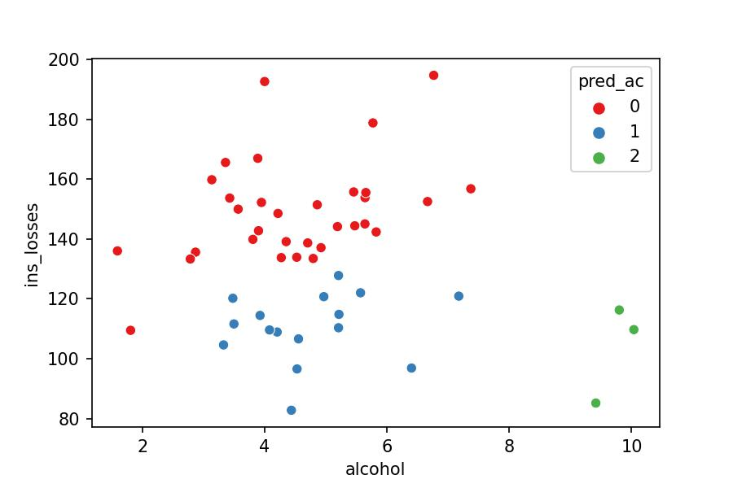

```python
import dataframe_image as dfi
import matplotlib.pyplot as plt
```


**© Jesús López**

Ask him any doubt on **[Twitter](https://twitter.com/jsulopz)** or **[LinkedIn](https://linkedin.com/in/jsulopz)**

<a href="https://colab.research.google.com/github/jsulopz/resolving-machine-learning/blob/main/05_Cluster%20Analysis%20con%20k-Means/05_clustering-kmeans_session_solution.ipynb">
  
</a>


# 05 | Cluster Analysis with k-Means

## Challenge Importance

The time has come to add another layer in the hierarchy of Machine Learning models.

Do we have the variable we want to predict in the dataset?

YES: **Supervised Learning**

- Predicting a Numerical Variable → Regression
- Predicting a Categorical Variable → Classification

NO:  **Unsupervised Learning**
- Group Data Points based on Explanatory Variables → Cluster Analysis

We may have, for example, all football players and we want to group them based on their performance. But we don't know the groups beforehand. What do we do then?

We apply Unsupervised Machine Learning models to group the players based on their position in the space (determined by the explanatory variables): the closer the players are in the space, the more likely they'll be drawn to the same group.

Another common example comes from e-commerces that don't know if their customers like clothing or tech. But they know how they interact in the website. Therefore, they group the customers to send promotional emails align with their likes.

In short, we close the circle with the different types of Machine Learning models by adding this new type.

Let's now develop the Python code.

## Load the Data

Imagine for a second you are the president of the United States of America and you are considering to create campaigns to reduce **car accidents due to alcohol** consumption controlling the impact of **insurance companies losses** as well (columns).

You won't create 51 different TV campaigns for each one of the **States of USA** (rows). Instead, you will see which States behave in a similar manner to cluster them into 3 groups.


```python
import seaborn as sns #!
import pandas as pd

df_crashes = sns.load_dataset(name='car_crashes', index_col='abbrev')[['alcohol', 'ins_losses']]
df_crashes
```


## Data Preprocessing

### Missing Data

We don't have any missing data in any of the columns:


```python
df_crashes.isna().sum()
```


    alcohol       0
    ins_losses    0
    dtype: int64


### Dummy Variables

Neither we need to convert categorical columns to *dummy variables* because the two we are considering are numerical.


```python
df_crashes
```



## How do we compute a k-Means Model in Python?

We should know from previous chapters that we need function which is accessible from a Class in the library `sklearn`.

### Import the Class


```python
from sklearn.cluster import KMeans
```

### Instantiante the Class

To create a copy of the original's code blueprint in order to not "modify" the source code.


```python
model_km = KMeans()
```

### Access the Function

The theoretical action we'd like to perform is the same we executed in previous chapters. Therefore, the function to compute the Machine Learning model should be called the same way:


```python
model_km.fit()
```


    ---------------------------------------------------------------------------

    TypeError                                 Traceback (most recent call last)

    Input In [6], in <cell line: 1>()
    ----> 1 model_km.fit()


    TypeError: fit() missing 1 required positional argument: 'X'


The previous types of models were asking for two parameters:

- `y`: target ~ independent ~ label ~ class variable
- `X`: explanatory ~ dependent ~ feature variables

Why is it asking for just one parameter now, `X`?

As we said before, this type of models (unsupervised learning) don't know how the groups are calculated beforehand; they know after we compute the Machine Learning model. Therefore, they don't need to know the target variable `y`

### Separate the Variables

We don't need to separate the variables because we just have explanatory ones.

### Fit the Model


```python
model_km.fit(X=df_crashes)
```


    KMeans()


### Predictions

#### Calculate Predictions

We have a fitted `KMeans`. Therefore, we should be able to apply the mathematical equation to the original data to get the predictions:


```python
model_km.predict(X=df_crashes)
```


    array([7, 3, 0, 7, 6, 7, 6, 1, 3, 7, 7, 5, 4, 7, 0, 5, 3, 3, 2, 4, 2, 3,
           1, 3, 1, 7, 4, 5, 7, 5, 1, 5, 1, 3, 0, 3, 6, 0, 1, 1, 5, 4, 1, 1,
           0, 0, 1, 0, 1, 0, 5], dtype=int32)


We wanted to calculate three groups, but Python is calculating eight groups. Let's modify this hyperparameter of the `KMeans` model:


```python
model_km = KMeans(n_clusters=3)
model_km.fit(X=df_crashes)
model_km.predict(X=df_crashes)
```


    array([0, 0, 1, 0, 2, 0, 2, 0, 0, 0, 0, 1, 1, 0, 1, 1, 0, 0, 2, 1, 2, 0,
           0, 0, 0, 0, 1, 1, 0, 1, 0, 1, 0, 0, 1, 0, 2, 1, 0, 0, 1, 1, 0, 0,
           1, 1, 0, 1, 0, 1, 1], dtype=int32)


#### Add a New Column with the Predictions

Let's create a new `DataFrame` to keep the original dataset untouched:


```python
df_pred = df_crashes.copy()
```

And add the predictions:


```python
df_pred['pred_km'] = model_km.predict(X=df_crashes)
df_pred
```


How can we see the groups in plot?

### Model Visualization & Interpretation

Can you observe that the k-Means only takes into account the variable `ins_losses` to determine the group the point belongs to? Why?


```python
sns.scatterplot(x='alcohol', y='ins_losses', hue='pred_km',
                palette='Set1', data=df_pred);
```




The model measures the distance between the points. They seem to be spread around the plot, but they actually aren't; the plot doesn't place the points in perspective (it's lying to us).

## KMeans Algorithm

Take a look at the following video to understand how the `KMeans` algorithm computes the Mathematical Equation by **calculating distances**:

%[https://www.youtube.com/watch?v=4b5d3muPQmA]

The model understands the data as follows:


```python
import matplotlib.pyplot as plt

sns.scatterplot(x='alcohol', y='ins_losses', hue='pred_km',
                palette='Set1', data=df_pred)
plt.xlim(0, 200)
plt.ylim(0, 200);
```



Now it's very clear why the model just took into account `ins_losses`: it barely sees significant distances within `alcohol` as compared to `ins_losses`.

In other words with a metaphore: it is not the same to increase one kg of weight than one meter of height.

Then, how can we create a `KMeans` model that compares the two variables equally?

- We need to scale the data (i.e., transforming the values into the same range: from 0 to 1) with the `MinMaxScaler`.

## `MinMaxScaler()` the data

As any other algorithm within `sklearn` library, we need to:
    
1. Import the `Class`
2. Create the `instance`
3. `fit()` the numbers of the mathematical equation
4. `predict/transform` the data with the mathematical equation


```python
from sklearn.preprocessing import MinMaxScaler

scaler = MinMaxScaler()
scaler.fit(df_crashes)
data = scaler.transform(df_crashes)
data[:5]
```


    array([[0.47921847, 0.55636883],
           [0.34718769, 0.45684192],
           [0.42806394, 0.24636258],
           [0.50100651, 0.5323574 ],
           [0.20923623, 0.73980184]])


To better understand the information, let's convert the `array` into a `DataFrame`:


```python
df_scaled = pd.DataFrame(data, columns=df_crashes.columns, index=df_crashes.index)
df_scaled
```


## k-Means Model with *Scaled Data*

### Fit the Model


```python
model_km.fit(X=df_scaled)
```


    KMeans(n_clusters=3)


### Predictions

#### Calculate Predictions

We have a fitted `KMeans`. Therefore, we should be able to apply the mathematical equation to the original data to get the predictions:


```python
model_km.predict(X=df_scaled)
```


    array([1, 0, 0, 1, 1, 1, 1, 1, 0, 1, 1, 2, 0, 1, 0, 0, 0, 1, 1, 0, 1, 0,
           1, 0, 1, 1, 2, 0, 1, 0, 1, 0, 1, 0, 2, 0, 1, 0, 1, 1, 2, 2, 1, 1,
           0, 0, 1, 0, 1, 0, 0], dtype=int32)


#### Add a New Column with the Predictions


```python
df_pred['pred_km_scaled'] = model_km.predict(X=df_scaled)
df_pred
```



### Model Visualization & Interpretation

We can observe now that both `alcohol` and `ins_losses` are taken into account by the model to calculate the cluster a point belongs to.


```python
sns.scatterplot(x='alcohol', y='ins_losses', hue='pred_km_scaled',
                palette='Set1', data=df_pred);
```


## Takeaway

From now on, we should understand that, every time a model is calculating distances between variables of different numerical ranges, we need to scale the data to compare them properly.

The following figure gives an overview of everything that has happened so far:


```python
fig, ((ax1, ax2), (ax3, ax4)) = plt.subplots(2, 2, figsize=(14, 7))

sns.scatterplot(x='alcohol', y='ins_losses', hue='pred_km',
                data=df_pred, palette='Set1', ax=ax1);

sns.scatterplot(x='alcohol', y='ins_losses', hue=df_pred.pred_km_scaled,
                data=df_scaled, palette='Set1', ax=ax2);

sns.scatterplot(x='alcohol', y='ins_losses', hue='pred_km',
                data=df_pred, palette='Set1', ax=ax3);

sns.scatterplot(x='alcohol', y='ins_losses', hue=df_pred.pred_km_scaled,
                data=df_scaled, palette='Set1', ax=ax4);

ax3.set_xlim(0, 200)
ax3.set_ylim(0, 200)

ax4.set_xlim(0, 200)
ax4.set_ylim(0, 200)

ax1.set_title('KMeans w/ Original Data & Liar Plot')
ax2.set_title('KMeans w/ Scaled Data & Perspective Plot')
ax3.set_title('KMeans w/ Original Data & Perspective Plot')
ax4.set_title('KMeans w/ Original Data & Perspective Plot')

plt.tight_layout()
```


## Other `Clustering` Models in Python

Visit the [`sklearn` website](https://scikit-learn.org/stable/modules/clustering.html#clustering) to see how many different clustering methods are and how they differentiate from each other.

Let's **pick 2 new models** and compute them:

### Agglomerative Clustering

We follow the same procedure as for any Machine Learning model from Scikit-Learn library:

#### Fit the Model


```python
from sklearn.cluster import AgglomerativeClustering

model_ac = AgglomerativeClustering(n_clusters=3)
model_ac.fit(df_scaled)
```


    AgglomerativeClustering(n_clusters=3)


#### Calculate Predictions


```python
model_ac.fit_predict(X=df_scaled)
```


    array([0, 0, 1, 0, 0, 0, 0, 0, 0, 0, 0, 1, 1, 0, 1, 1, 0, 0, 0, 1, 0, 0,
           0, 0, 0, 0, 2, 1, 0, 1, 0, 1, 0, 1, 2, 0, 0, 1, 0, 0, 2, 1, 0, 0,
           0, 1, 0, 1, 0, 1, 1])


#### Create a New Column for the Predictions


```python
df_pred['pred_ac'] = model_ac.fit_predict(X=df_scaled)
df_pred
```



#### Visualize the Model

We can observe how the second group just takes three points with the Agglomerative Clustering while the KMeans makes gathers five points in the second group.

As they are different algorithms, it is normal that they produce different results. If you'd like to get deeper into which models should you use, you may know how the algorithm works. We don't explain it in this series because we want to make it simple.


```python
fig, (ax1, ax2) = plt.subplots(1, 2, figsize=(10, 5))

sns.scatterplot(x='alcohol', y='ins_losses', hue='pred_km_scaled',
                data=df_pred, palette='Set1', ax=ax1);

sns.scatterplot(x='alcohol', y='ins_losses', hue='pred_ac',
                data=df_pred, palette='Set1', ax=ax2)

ax1.set_title('KMeans')
ax2.set_title('Agglomerative Clustering');
```


### Spectral Clustering

We follow the same procedure as for any Machine Learning model from Scikit-Learn library:

#### Fit the Model


```python
from sklearn.cluster import SpectralClustering

model_sc = SpectralClustering(n_clusters=3)
model_sc.fit(df_scaled)
```


    SpectralClustering(n_clusters=3)


#### Calculate Predictions


```python
model_sc.fit_predict(X=df_scaled)
```


    array([0, 2, 2, 0, 0, 2, 0, 0, 2, 0, 0, 1, 2, 0, 2, 2, 2, 0, 0, 2, 0, 2,
           0, 2, 0, 0, 1, 2, 0, 2, 0, 2, 0, 2, 1, 2, 0, 2, 0, 0, 1, 1, 0, 0,
           2, 2, 0, 2, 0, 2, 2], dtype=int32)


#### Create a New Column for the Predictions


```python
df_pred['pred_sc'] = model_sc.fit_predict(X=df_scaled)
df_pred
```



#### Visualize the Model

Let's visualize all models together and appreciate the small differences because they cluster the groups in different ways.


```python
fig, (ax1, ax2, ax3) = plt.subplots(1, 3, figsize=(15, 5))

ax1.set_title('KMeans')
sns.scatterplot(x='alcohol', y='ins_losses', hue='pred_km_scaled',
                data=df_pred, palette='Set1', ax=ax1);

ax2.set_title('Agglomerative Clustering')
sns.scatterplot(x='alcohol', y='ins_losses', hue='pred_ac',
                data=df_pred, palette='Set1', ax=ax2);

ax3.set_title('Spectral Clustering')
sns.scatterplot(x='alcohol', y='ins_losses', hue='pred_sc',
                data=df_pred, palette='Set1', ax=ax3);
```



## Takeaway

Once again, you don't need to know the maths behind every Machine Learning model to build them. I hope you are getting the sense about the patterns behind the Scikit-Learn library with this series of tutorials.

## Use Case Conclusion

Let's arbitrarly choose the Agglomerative Clustering as our model and get back to you being the President of USA. How would you describe the groups?

0. Higher `ins_losses` and lower `alcohol`
1. Lower `ins_losses` and lower `alcohol`
2. Lower `ins_losses` and higher `alcohol`


```python
sns.scatterplot(x='alcohol', y='ins_losses', hue='pred_ac', data=df_pred, palette='Set1');
```



You would create different messages on the TV campaigns for the three groups separately and avoid deploying many more resources to create fifty one different TV campaigns (one for each State), which doesn't make sense because many of them are similar.

<a rel="license" href="http://creativecommons.org/licenses/by-nc-nd/4.0/"></a><br />This work is licensed under a <a rel="license" href="http://creativecommons.org/licenses/by-nc-nd/4.0/">Creative Commons Attribution-NonCommercial-NoDerivatives 4.0 International License</a>.
