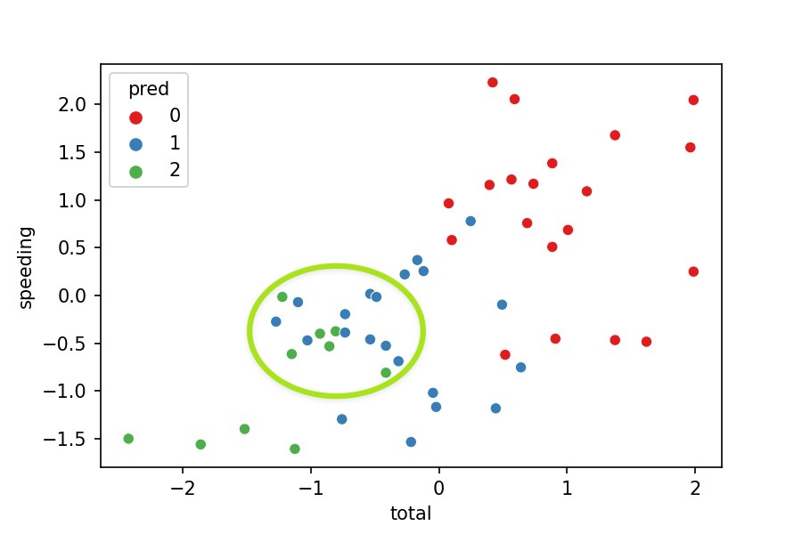
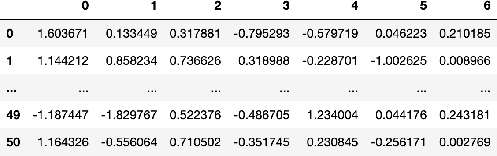
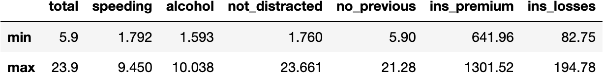
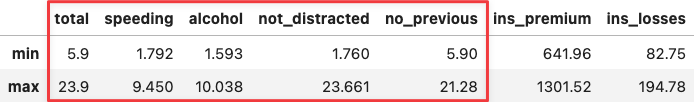
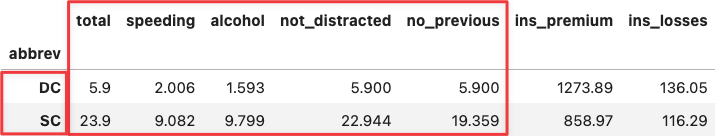
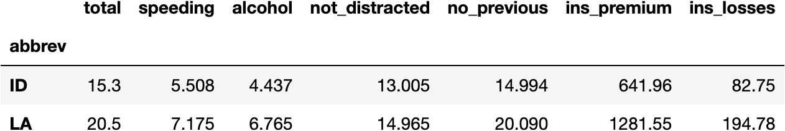

```python
import dataframe_image as dfi
import matplotlib.pyplot as plt
```


**© Jesús López**

Ask him any doubt on **[Twitter](https://twitter.com/jsulopz)** or **[LinkedIn](https://linkedin.com/in/jsulopz)**

<a href="https://colab.research.google.com/github/jsulopz/resolving-machine-learning/blob/main/06_Principal%20Component%20Analysis%20%28PCA%29/06_dimensionality-reduction-pca_session_solution.ipynb">
  
</a>


# 06 | Principal Component Analysis (PCA)

## Chapter Importance

We used just two variables out of the seven we had in the whole DataFrame.

We could have computed better cluster models as we give more information to the Machine Learning model. Nevertheless, it would have been **harder to plot seven variables with seven axis in a graph**.

Is there anything we can do compute a clustering model with more than two variables and later represent all the points along with their variables?

- Yes, everything is possible with data. As one of my teachers told me: "you can torture the data untill it gives you what you want" (sometimes it's unethical, so behave).

We'll develop the code to show you the need for **dimensionality reduction** techniques. Especifically, the Principal Component Analysis (PCA).

## Load the Data

Imagine for a second you are the president of the United States of America and you are considering to create campaigns to reduce **car accidents**.

You won't create 51 different TV campaigns for each one of the **States of USA** (rows). Instead, you will see which States behave in a similar manner to cluster them into 3 groups, based on the variation accross their features (columns).


```python
import seaborn as sns #!

df_crashes = sns.load_dataset(name='car_crashes', index_col='abbrev')
df_crashes
```


> Check [this website](https://www.kaggle.com/fivethirtyeight/fivethirtyeight-bad-drivers-dataset/) to understand the measures of the following data.

## Data Preprocessing

From the previous chapter, we should know that we need to preprocess the Data so that variables with different scales can be compared.

For example, it is not the same to increase 1kg of weight, than 1m of height.

We will use `StandardScaler()` algorithm:


```python
from sklearn.preprocessing import StandardScaler

scaler = StandardScaler()
data_scaled = scaler.fit_transform(df_crashes)
data_scaled[:5]
```


    array([[ 0.73744574,  1.1681476 ,  0.43993758,  1.00230055,  0.27769155,
            -0.58008306,  0.4305138 ],
           [ 0.56593556,  1.2126951 , -0.21131068,  0.60853209,  0.80725756,
             0.94325764, -0.02289992],
           [ 0.68844283,  0.75670887,  0.18761539,  0.45935701,  1.03314134,
             0.0708756 , -0.98177845],
           [ 1.61949811, -0.48361373,  0.54740815,  1.67605228,  1.95169961,
            -0.33770122,  0.32112519],
           [-0.92865317, -0.39952407, -0.8917629 , -0.594276  , -0.89196792,
            -0.04841772,  1.26617765]])


Let's turn the array into a DataFrame for better understanding:


```python
import pandas as pd

df_scaled = pd.DataFrame(data_scaled, index=df_crashes.index, columns=df_crashes.columns)
df_scaled
```


Now we see all the variables having the same scale (i.e., around the same limits):


```python
df_scaled.agg(['min', 'max'])
```


## k-Means Model in Python

We follow the usual Scikit-Learn procedure to develop Machine Learning models.

### Import the Class


```python
from sklearn.cluster import KMeans
```

### Instantiate the Class


```python
model_km = KMeans(n_clusters=3)
```

### Fit the Model


```python
model_km.fit(X=df_scaled)
```


    KMeans(n_clusters=3)


### Calculate Predictions


```python
model_km.predict(X=df_scaled)
```


    array([1, 1, 1, 1, 2, 0, 2, 1, 2, 1, 0, 1, 0, 0, 0, 0, 0, 1, 1, 0, 2, 2,
           2, 2, 0, 1, 1, 0, 0, 0, 2, 0, 2, 1, 1, 0, 1, 0, 1, 2, 1, 1, 1, 1,
           0, 0, 0, 0, 1, 0, 1], dtype=int32)


### Create a New DataFrame for the Predictions


```python
df_pred = df_scaled.copy()
```

### Create a New Column for the Predictions


```python
df_pred.insert(0, 'pred', model_km.predict(X=df_scaled))
df_pred
```


### Visualize the Model

Now let's visualize the clusters with a 2-axis plot:


```python
sns.scatterplot(x='total', y='speeding', hue='pred',
                data=df_pred, palette='Set1');
```


### Model Interpretation

Does the visualization makes sense?

- No, because the clusters should clearly separate their points from others. Nevertheless, we see some green points in the middle of the blue cluster.



Why is this happening?

- We are **just representing 2 variables** where the model was **fitted with 7 variables**. As we miss 5 variables in the plot, we can't see the points clearly separated.

Why don't we add 5 variables to the plot then?

- We could, but it'd be way to hard to interpret.

Then, what could we do? 

- We can apply PCA, a dimensionality reduction technique. Take a look at the following video to understand this concept:

%[https://www.youtube.com/watch?v=HMOI_lkzW08]

## Grouping Variables with `PCA()`

### Transform Data to Components

`PCA()` is another technique used to transform data.

How has the data been manipulated so far?

1. Original Data `df_crashes`


```python
df_crashes
```


2. Normalized Data `df_scaled`


```python
df_scaled
```


3. Principal Components Data `dfpca` (now)


```python
from sklearn.decomposition import PCA

pca = PCA()
data_pca = pca.fit_transform(df_scaled)
data_pca[:5]
```


    array([[ 1.60367129,  0.13344927,  0.31788093, -0.79529296, -0.57971878,
             0.04622256,  0.21018495],
           [ 1.14421188,  0.85823399,  0.73662642,  0.31898763, -0.22870123,
            -1.00262531,  0.00896585],
           [ 1.43217197, -0.42050562,  0.3381364 ,  0.55251314,  0.16871805,
            -0.80452278, -0.07610742],
           [ 2.49158352,  0.34896812, -1.78874742,  0.26406388, -0.37238226,
            -0.48184939, -0.14763646],
           [-1.75063825,  0.63362517, -0.1361758 , -0.97491605, -0.31581147,
             0.17850962, -0.06895829]])


```python
df_pca = pd.DataFrame(data_pca)
df_pca
```




```python
cols_pca = [f'PC{i}' for i in range(1, pca.n_components_+1)]
cols_pca
```


    ['PC1', 'PC2', 'PC3', 'PC4', 'PC5', 'PC6', 'PC7']


```python
df_pca = pd.DataFrame(data_pca, columns=cols_pca, index=df_crashes.index)
df_pca
```


### Visualize Components & Clusters

Let's visualize a **scatterplot** with `PC1` & `PC2` and colour points by cluster:


```python
import plotly.express as px

px.scatter(data_frame=df_pca, x='PC1', y='PC2', color=df_pred.pred)
```


Are they **mixed** now?

- No, they aren't.

That's because both PC1 and PC2 are representing almost 80% of the variability of the original seven variables.

You can see the following array, where every element represents the ammount of variability explained by every component:


```python
pca.explained_variance_ratio_
```


    array([0.57342168, 0.22543042, 0.07865743, 0.05007557, 0.04011   ,
           0.02837999, 0.00392491])


And the accumulated variability (79.88% until PC2):


```python
pca.explained_variance_ratio_.cumsum()
```


    array([0.57342168, 0.7988521 , 0.87750953, 0.9275851 , 0.9676951 ,
           0.99607509, 1.        ])


Which variables are representing these two components?

## Relationship between Original Variables & Components

### Loading Vectors

The Principal Components are produced by a **mathematical equation** (once again), which is composed by the following weigts:


```python
df_weights = pd.DataFrame(pca.components_.T, columns=df_pca.columns, index=df_scaled.columns)
df_weights.style.applymap(lambda v: f'background-color: darkorange; opacity: {int(v*100)+40}%;')\
        .applymap(lambda v: f'color: black')
```


We can observe that:
    
1. Socio-demographical features (total, speeding, alcohol, not_distracted & no_previous) have higher coefficients (higher influence) in PC1.
2. Whereas insurance features (ins_premium & ins_losses) have higher cofficients in PC2.

Principal Components is a technique that gathers the maximum ammount of variability of a set of features (variables) into Components.

Therefore, the two first Principal Components accaparate a good ammount of common data because we see two sets of variables that are correlated between each other:

### Correlation Matrix


```python
df_corr = df_scaled.corr()
sns.heatmap(df_corr, annot=True, vmin=0, vmax=1);
```


I hope that everything is making sense so far.

To ultimate the explanation, you can see below how `df_pca` values are computed:

### Calculating One PCA Value

For example, we can multiply the weights of PC1 with the oringal variables for **AL**abama:


```python
(df_weights['PC1']*df_scaled.loc['AL']).sum()
```


    1.6036712920638672


To get the transformed value of the Principal Component 1 for **AL**abama State:


```python
df_pca.head().style.applymap(lambda x: f'background-color: darkred; color: white' if round(x,2)==1.60 else False)
```


> The same operation applies to any value of `df_pca`.

## PCA & Cluster Interpretation

Now, let's go back to the PCA plot:


```python
px.scatter(data_frame=df_pca, x='PC1', y='PC2', color=df_pred.pred.astype(str))
```


How can we interpret the clusters with the components?

Let's add information to the points thanks to animated plots from `plotly` library:


```python
hover = '''
<b>%{customdata[0]}</b><br><br>
PC1: %{x}<br>
Total: %{customdata[1]}<br>
Alcohol: %{customdata[2]}<br><br>
PC2: %{y}<br>
Ins Losses: %{customdata[3]}<br>
Ins Premium: %{customdata[4]}
'''

fig = px.scatter(data_frame=df_pca, x='PC1', y='PC2',
                 color=df_pred.pred.astype(str),
                 hover_data=[df_pca.index, df_crashes.total, df_crashes.alcohol,
                             df_crashes.ins_losses, df_crashes.ins_premium])

fig.update_traces(hovertemplate = hover)
```


If you hover the mouse over the two most extreme points along the x-axis, you can see that their values coincide with the `min` and `max` values accross socio-demographical features:


```python
df_crashes.agg(['min', 'max'])
```






```python
df_crashes.loc[['DC', 'SC'],:]
```




Apply the same reasoning over the two most extreme points along the y-axis and you will see the same for the `ins`urance variables because the positioning of the PC2 (y-axis) is determined by the `ins`urance variables.


```python
df_crashes.agg(['min', 'max'])
```


```python
df_crashes.loc[['ID', 'LA'],:]
```




Is there a way to represent the weights of the original data for the Principal Components as well as the points?

Absolutely, that's called a Biplot, which we will see later.

### Biplot


```python
import numpy as np

loadings = pca.components_.T * np.sqrt(pca.explained_variance_)
evr = pca.explained_variance_ratio_.round(2)

fig = px.scatter(df_pca, x='PC1', y='PC2',
                 color=model_km.labels_.astype(str),
                 hover_name=df_pca.index,
                labels={
                    'PC1': f'PC1 ~ {evr[0]}%',
                    'PC2': f'PC2 ~ {evr[1]}%'
                })

for i, feature in enumerate(df_scaled.columns):
    fig.add_shape(
        type='line',
        x0=0, y0=0,
        x1=loadings[i, 0],
        y1=loadings[i, 1],
        line=dict(color="red",width=3)
    )
    fig.add_annotation(
        x=loadings[i, 0],
        y=loadings[i, 1],
        ax=0, ay=0,
        xanchor="center",
        yanchor="bottom",
        text=feature,
    )

fig.show()
```


## Conclusion

Dimensionality Reduction techniques has many more applications, but I hope you got the essence: they are great to group variables who behave similarly and later visualize a lot of variables in just one component.

In short, you are simplifying the information of the data. In this example, we simplify the data from plotting seven to only two dimensions. Although we don't get this for free because we explain around 80% of the data's original variability.

<a rel="license" href="http://creativecommons.org/licenses/by-nc-nd/4.0/"></a><br />This work is licensed under a <a rel="license" href="http://creativecommons.org/licenses/by-nc-nd/4.0/">Creative Commons Attribution-NonCommercial-NoDerivatives 4.0 International License</a>.
